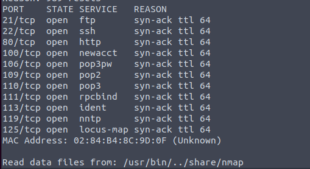
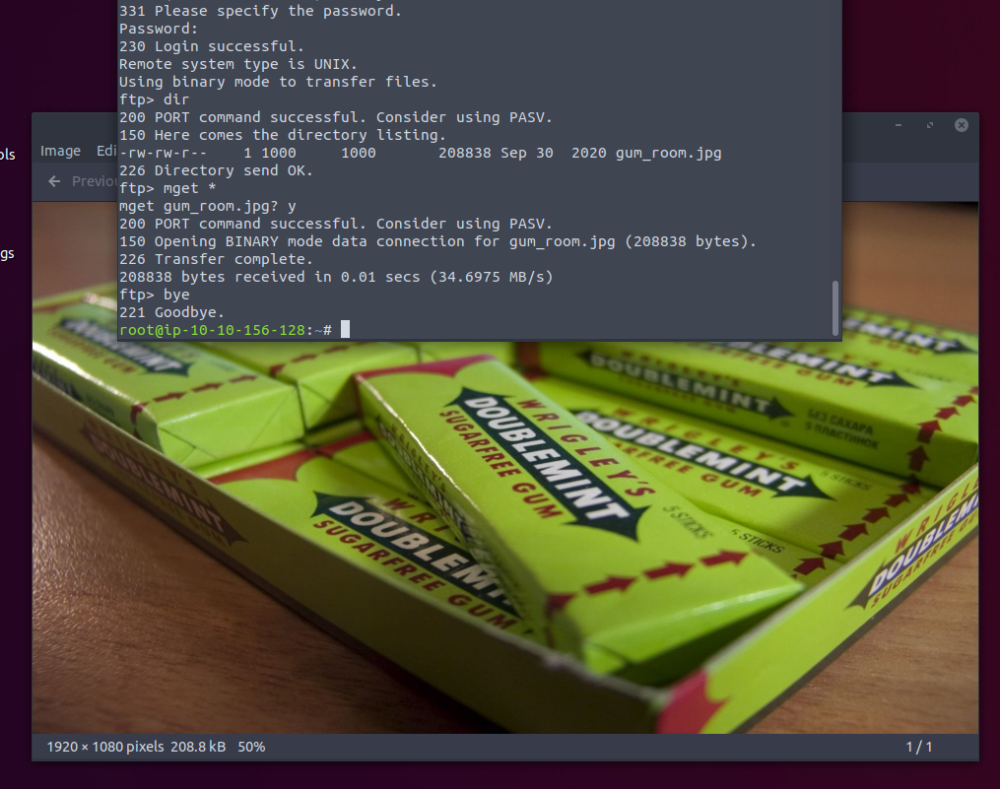
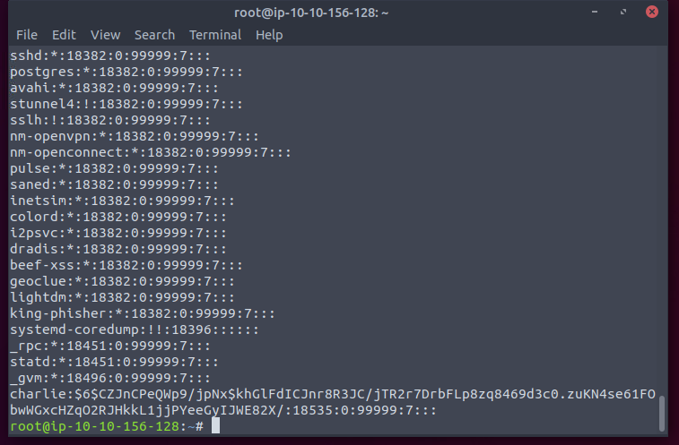
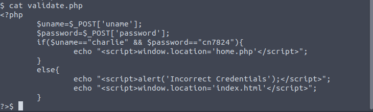
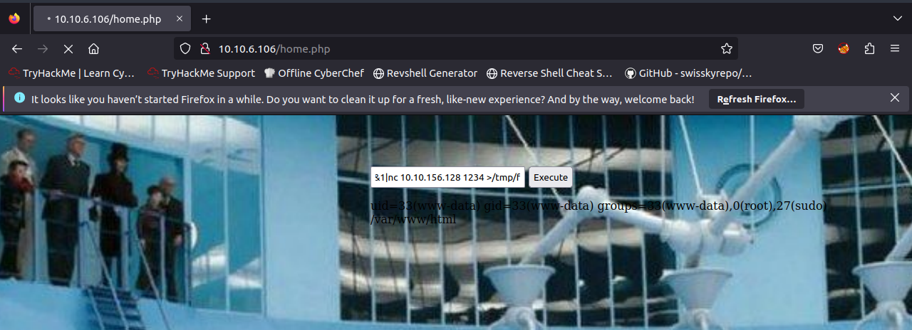
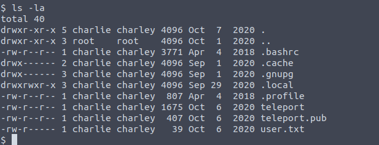
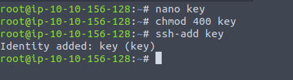

Lots of ports. FTP first.

A pic of gum. Since it is jpg. Try steg.

Oh. Looks like we can john it. (And actually it costs several minutes.)

Later on I find we can directly into the webshell page. Alright.

.pub? Then it must be private/public key pair.

No password protected. Good.

The charile user can sudo the vi. Done.

