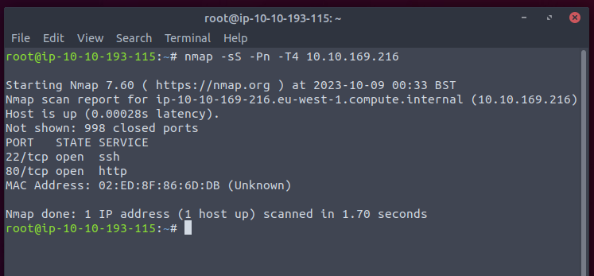

Only 2 ports open. Bust the web first.

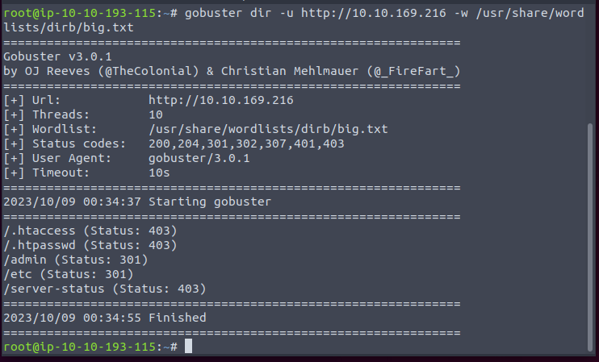

Hmm. /etc seems like the linux folder.

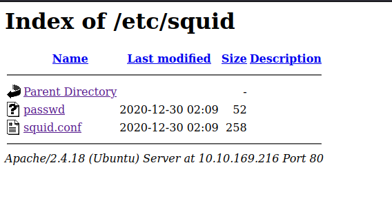

At least a share. The passwd contains the salt. So I think we can use hashcat.

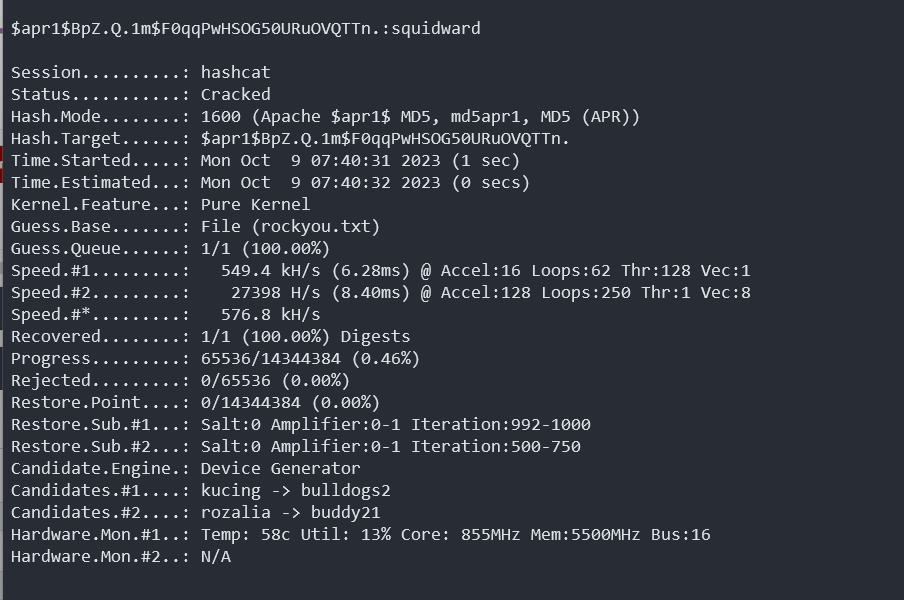

Get the password. Then try to find somewhere we can use.

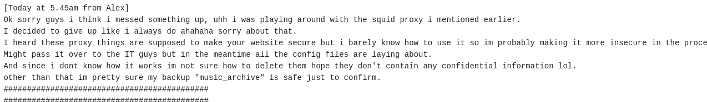

From this, seems like the password is used to encrypt the archive.

We can download a zip from the website. But it is unencrypted.

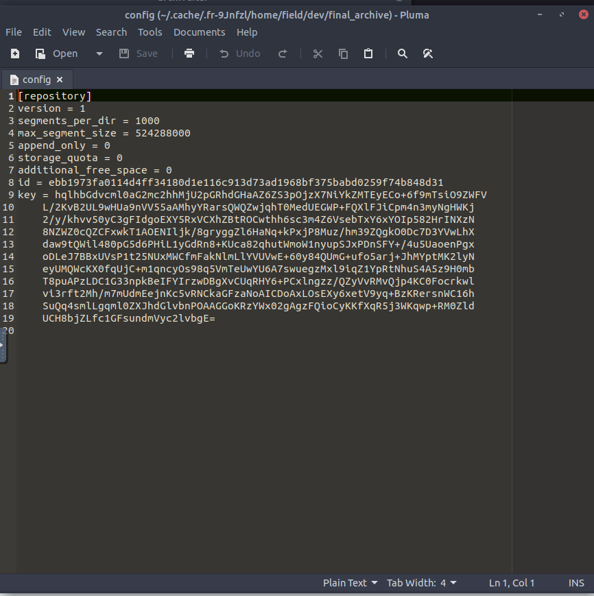

The key here is quite interesting though.

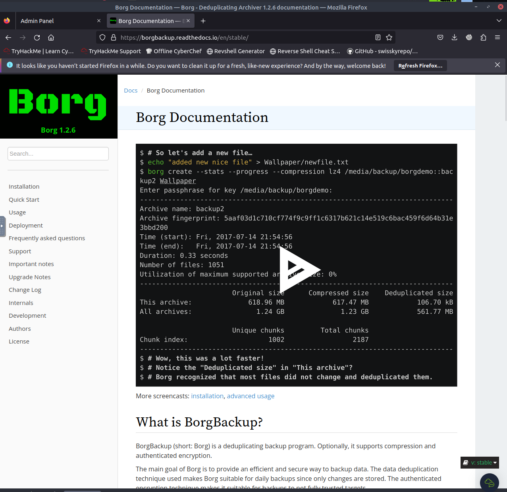

Seems like the backup is inside the zip.

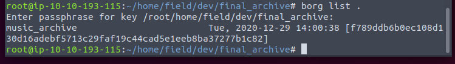

Exactly.

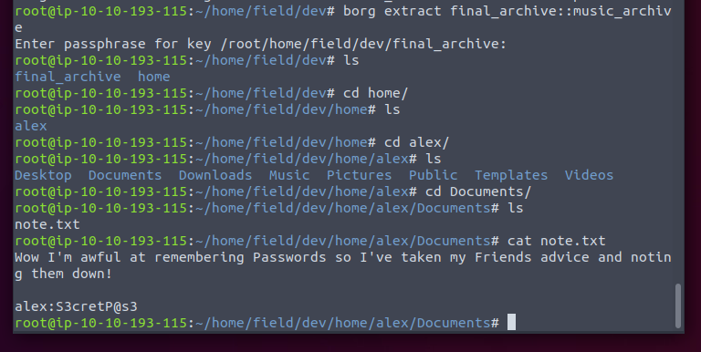

Guess it may be the ssh password.

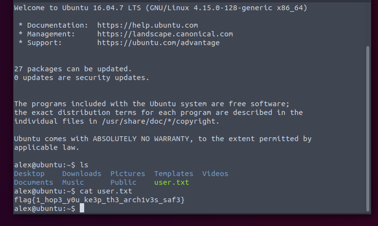

Then time for elevated.

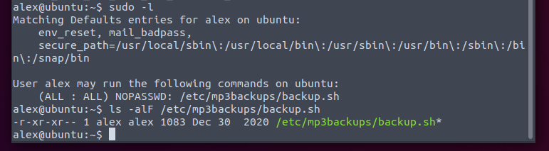

We can sudo the file we own. Simple reverse shell.

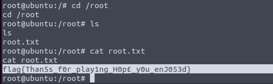

