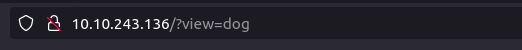
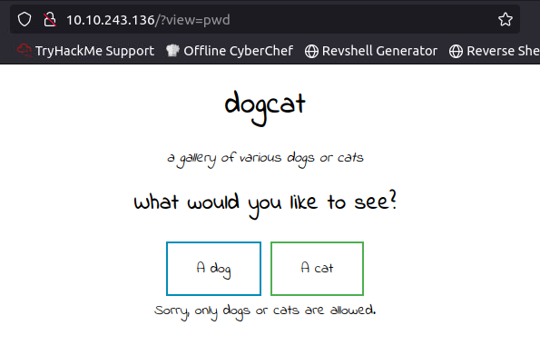
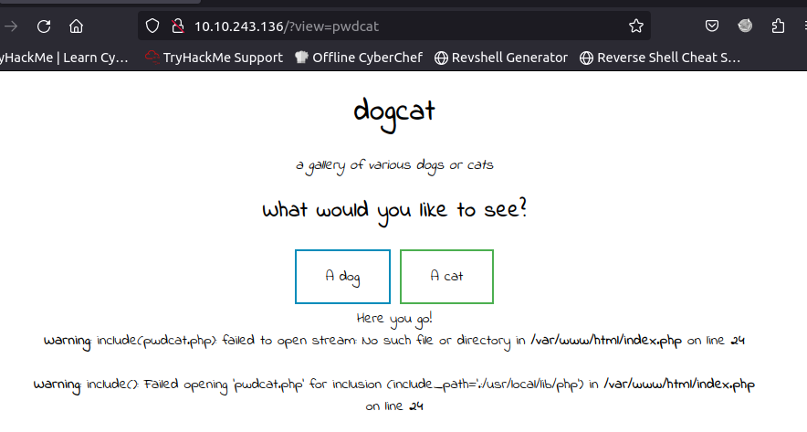
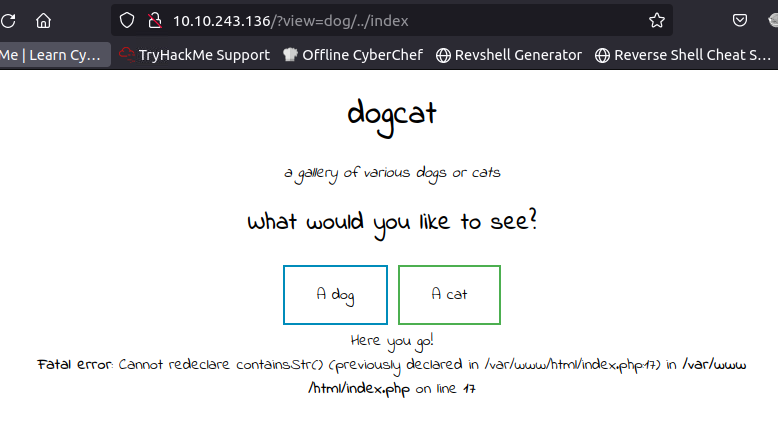
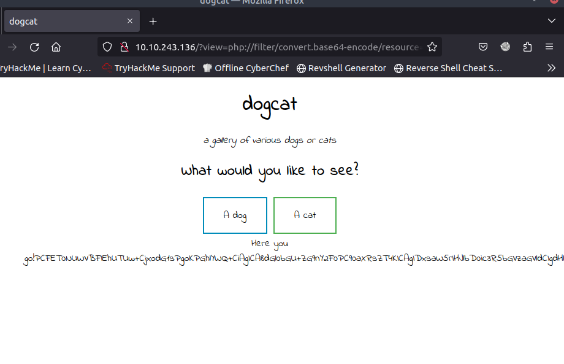
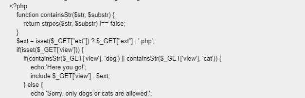

Forget to screenshot. But only 22 and 80 open. Bust find nothing than cats and dogs.

Seems like the `?view=` is the point.

Content filter exist.

Looks like it will add `.php` at the end automatically and the current folder is known.

For the next step, I would like to see the content of index.php which will help a lot.

Redeclare.. Right, It is already displayed in the screen. Then we want it to display again. So we need to encode it.

So we get the main function here.

Looks like there is a ext variable. We can set it to none so that we can view anything other than php.

Draft