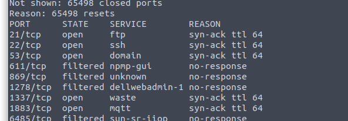

53 and 1883 are useless. 1337 is web. FTP allow anonymous login but contains nothing.

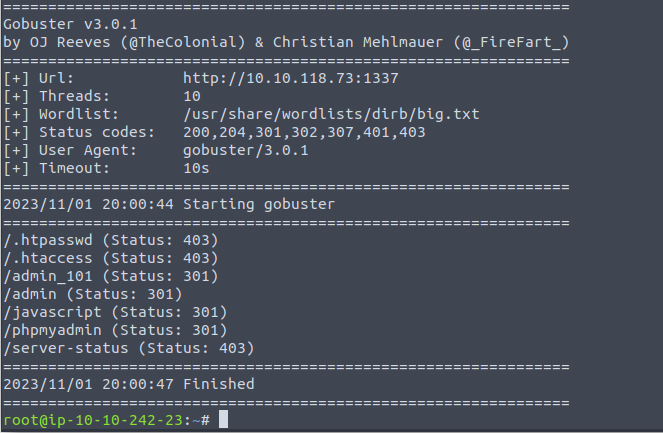

Two admin? Looks interesting.

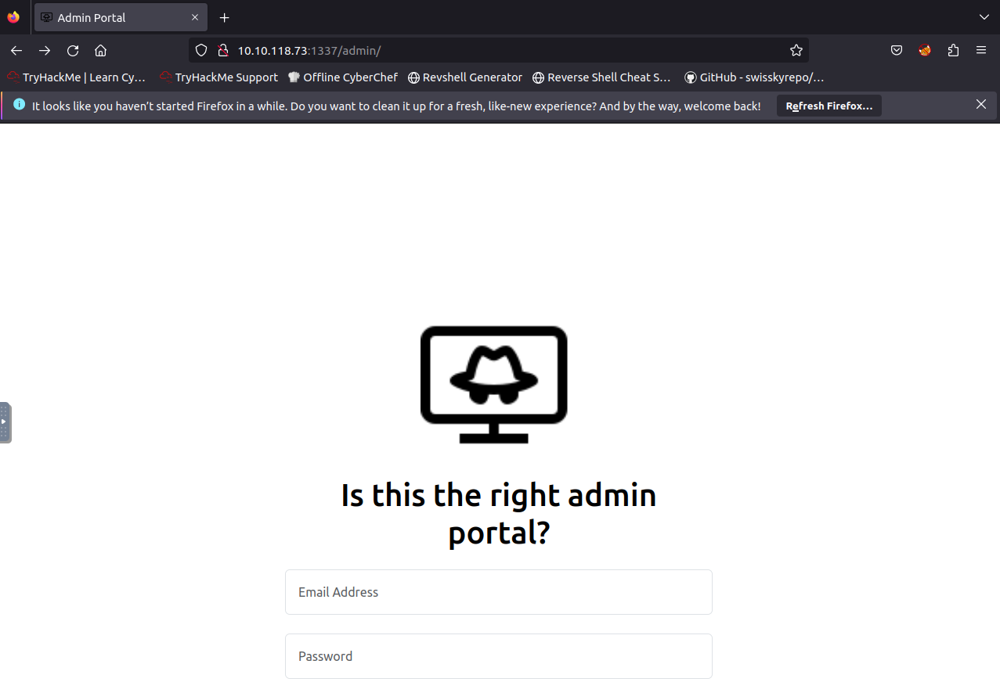

Well. Looks like only one of them are useful. The info says about sqlmap. So try it.

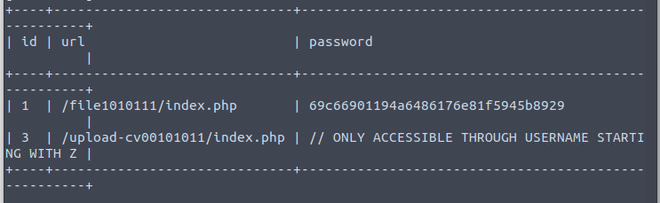

The link and their corresponding password.

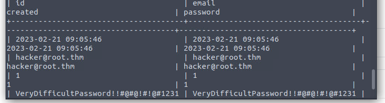

Also user/pass creds.

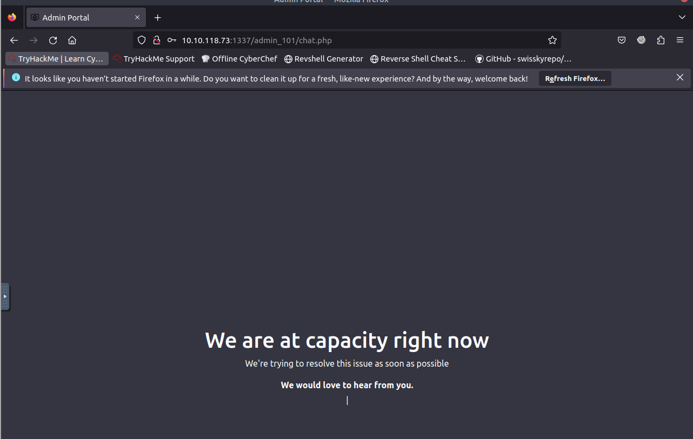

Hmm. Nothing. Try the link above.

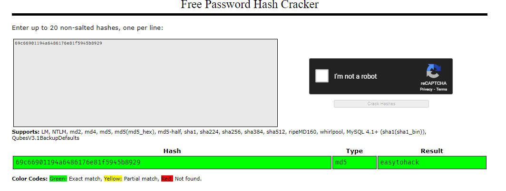

The hash is *easytohack* indeed.

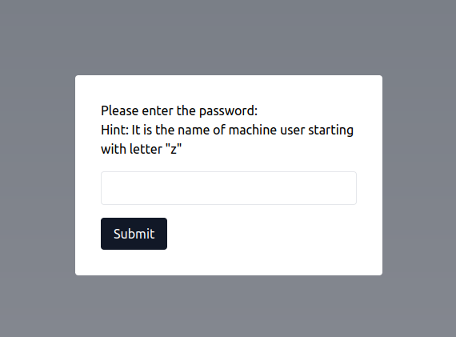

For the other website, we need to know the name of the user.

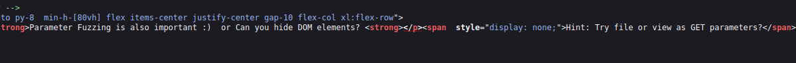

In the source file, it tells us to add a parameter likely.

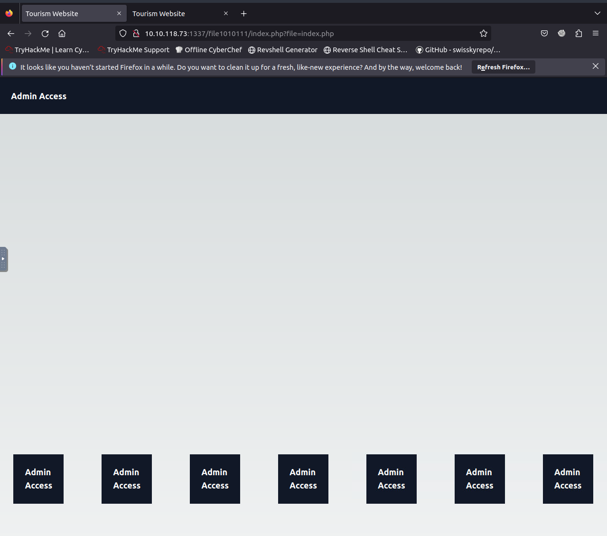

Well done. So probably we can view the /etc/passwd.

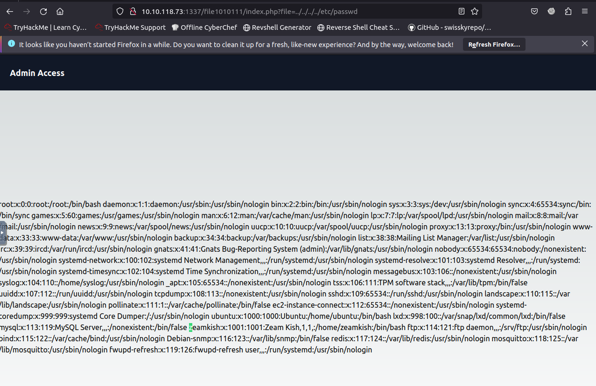

Okay.

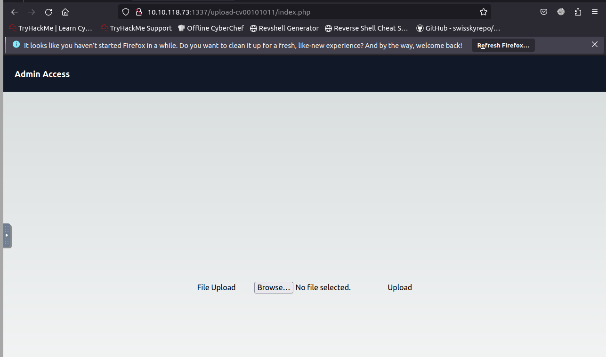

Seems like we can upload the webshell. However, if we take a look at the source.

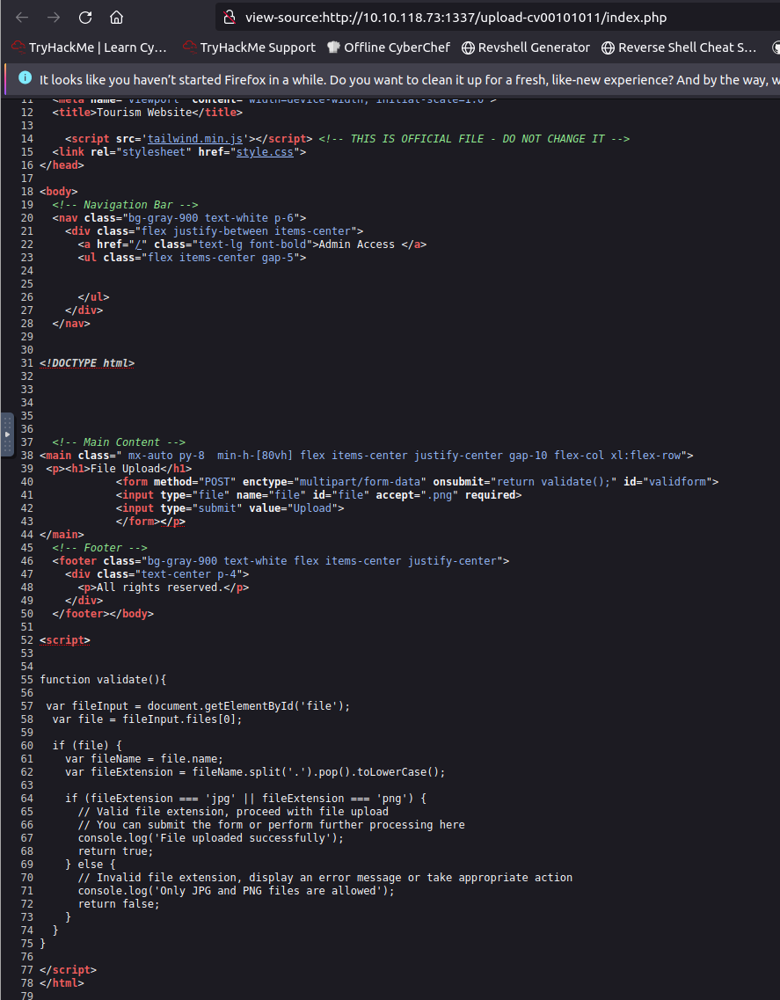

The filter is likely working. So we need to bypass it.

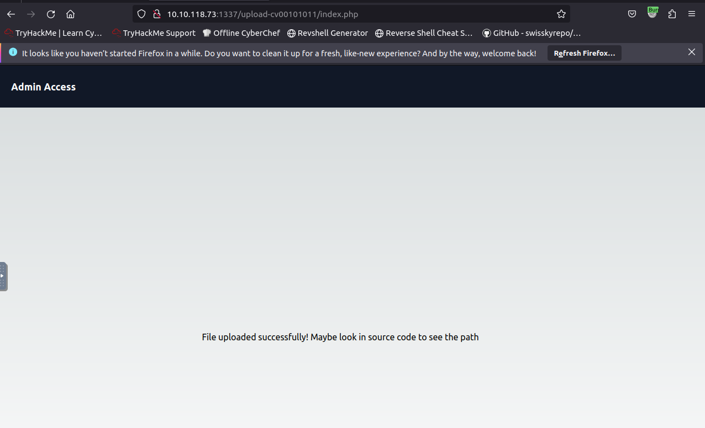

Simply bypass it. 

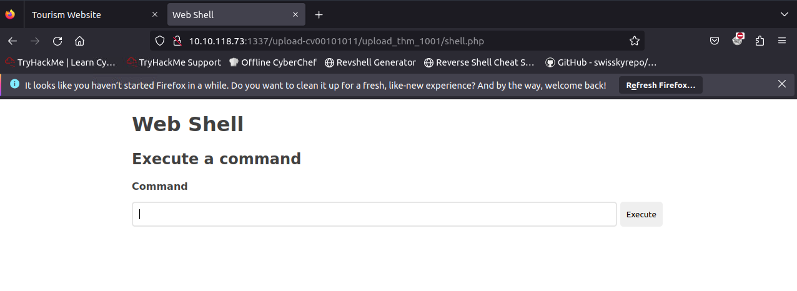

Time for reverse shell.

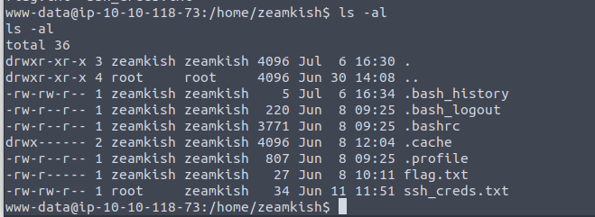

Everyone can read the ssh creds.

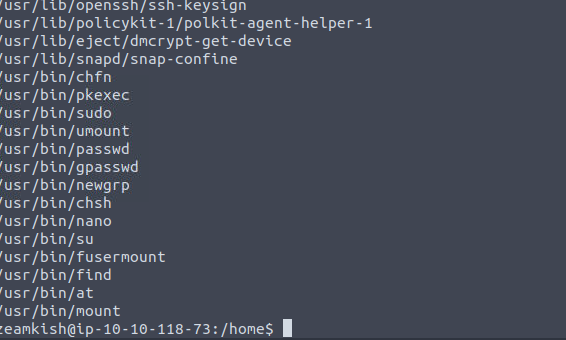

The nano have SUID. So done.

