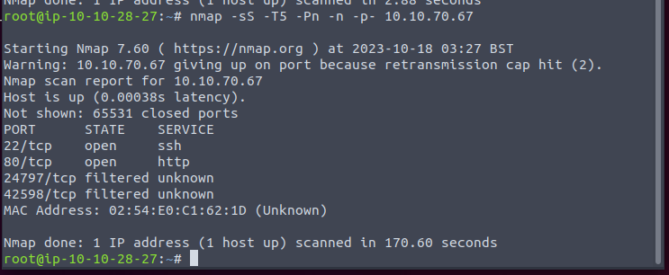
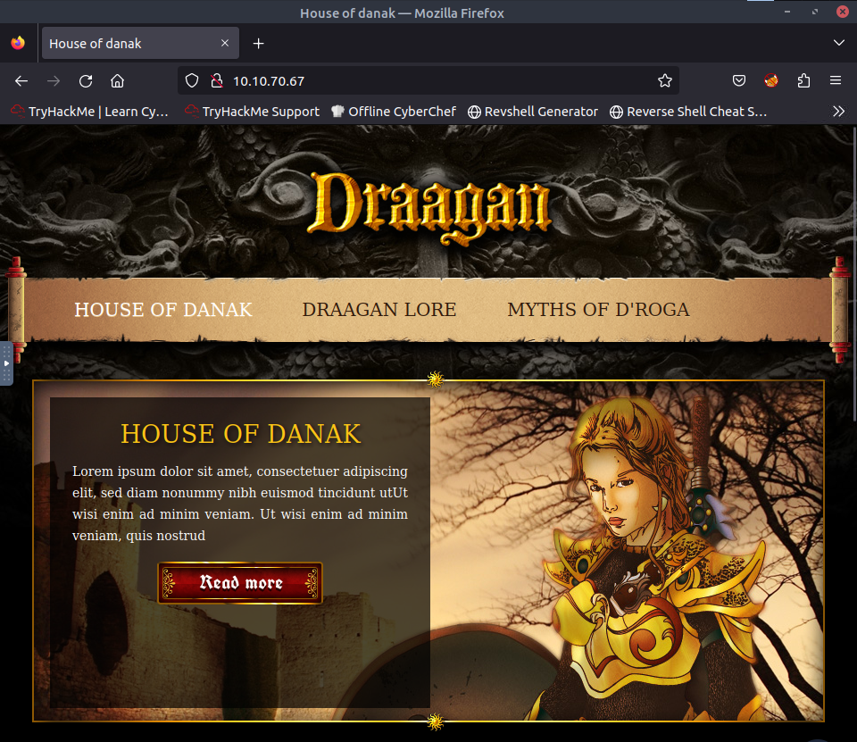
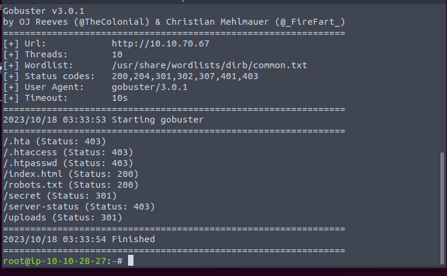
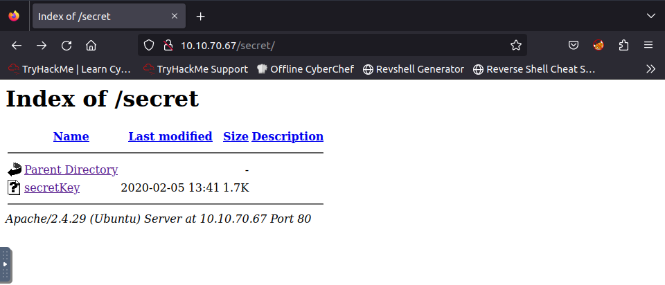
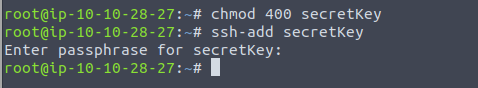
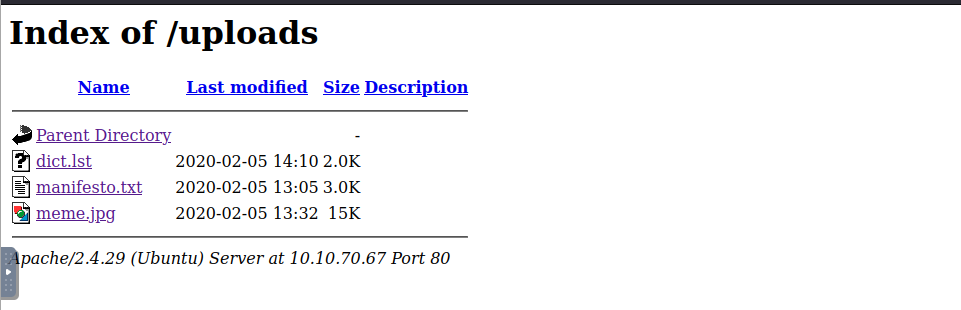
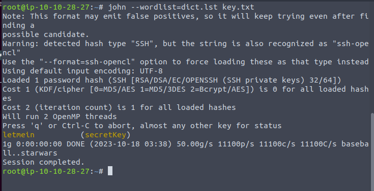
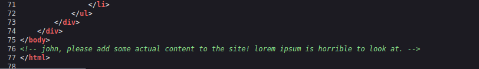
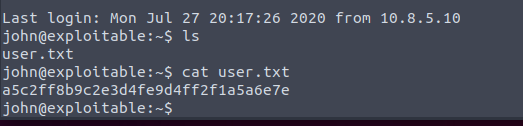
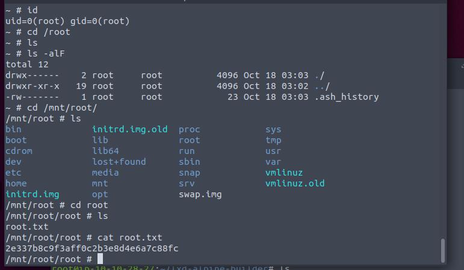

Port scan first.

A game server.

Secret and Uploads. Good.

A ssh key.

Looks like it is password protected.

The dict seems like to use to brute the key.

Get the key now. But we need a username.

Must be john I think.

Yes.

john is user of lxc group. So exploit it.

