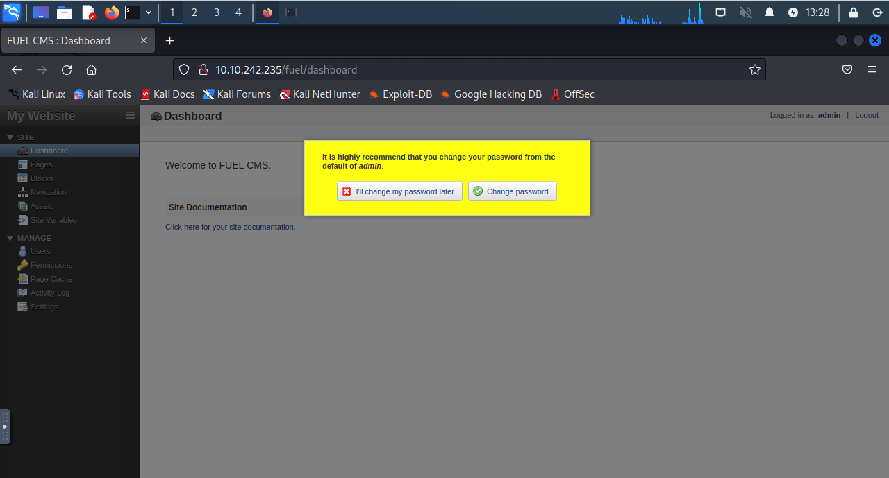

Only 80 open. Bust it.

Lots of results.. But some are permission required some points to same page.

Get a login page.

Maybe try to find some exploit. But try with default password first.

Alright. We in. But nothing interesting.

The exploit works. Time for reverse shell.

Time for elevated.

From the page, we can get the password for the root user of SQL. But actually the same for the system.

So get the root.
