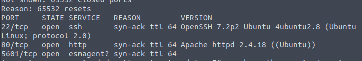
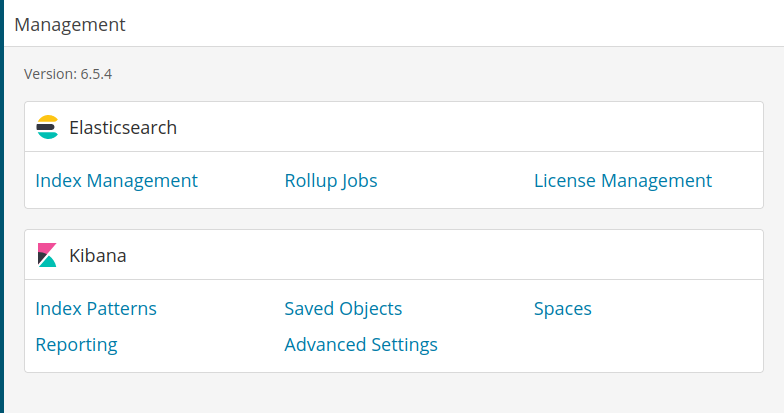
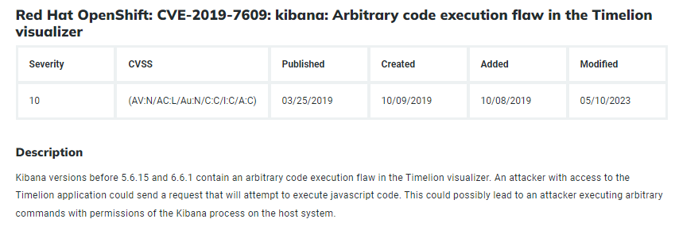
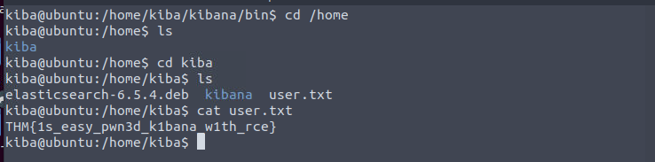
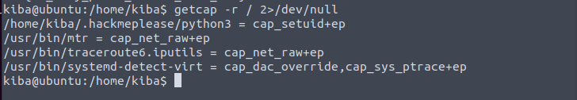
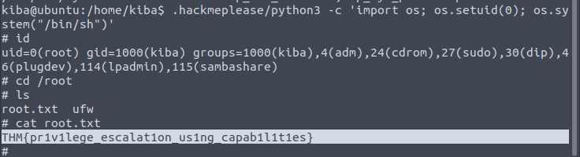

The info already tells it is about Kibana, which usually runs in higher ports. So we will do a full port scan first.

Yeah. In 5601.

Version 6.5.4. We can easily search for the CVE exist.

Hack it.

