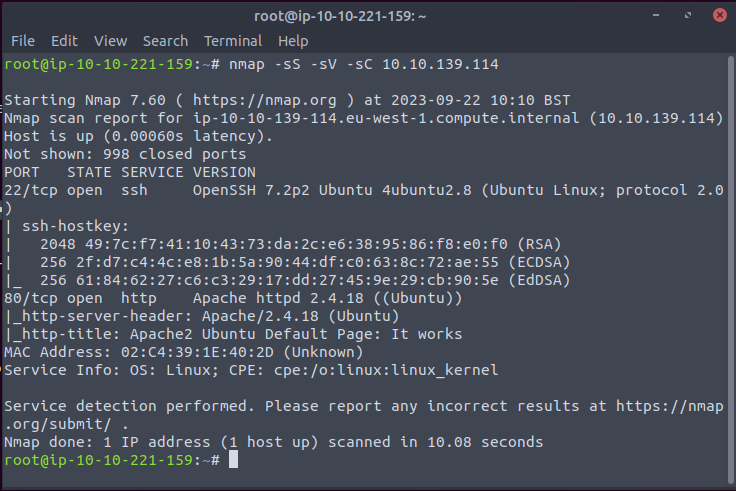
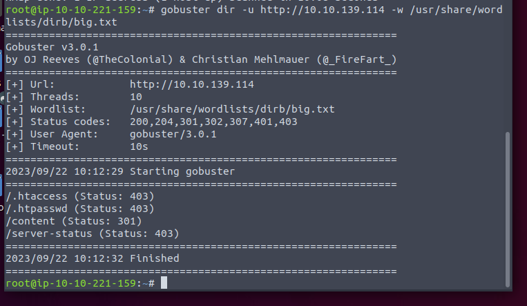
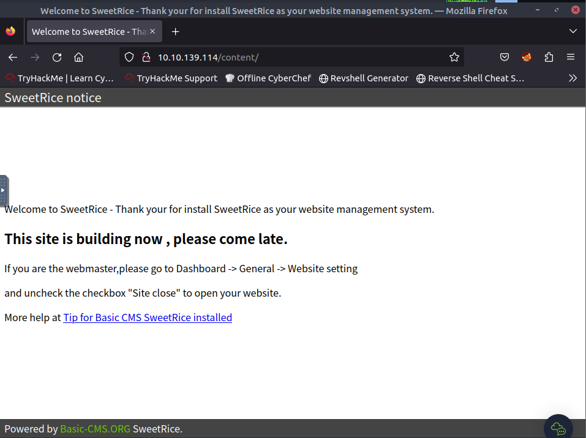
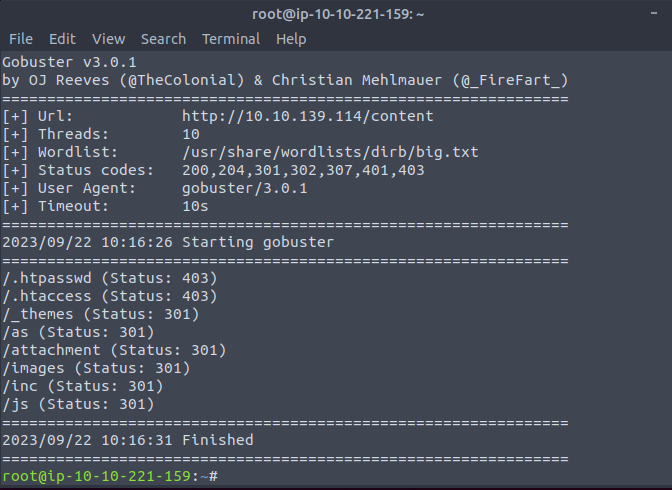
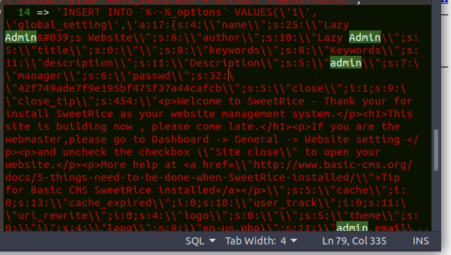
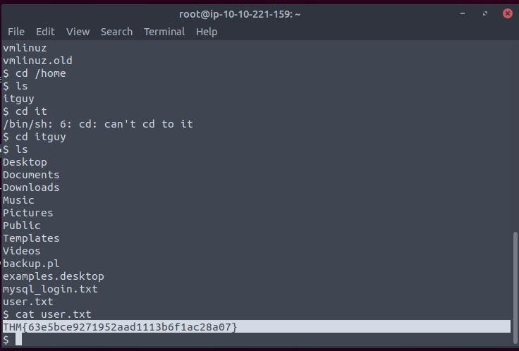
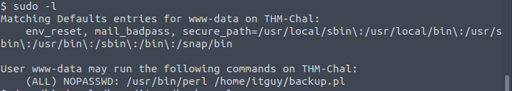
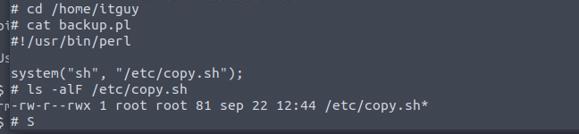

Nmap first

Look the website first. Default pages. So bust it.

Seems like a management panel. Bust again.

as is the admin panel attachment is uploads folder. If we can find somewhere to upload payload.

The Exploit-DB have several exploits for this. We can use [this](https://www.exploit-db.com/exploits/40718) to get the sql backup. As we know, this kinds of application normally have some startup pages where you would input your database user/pass etc.

Those seems like the username and the hash of password.

Well. Now we get the access to panel. According to [another]() exploit, we can upload something. So it is not hard to reverse shell.

Get the user flag.

Hmm. We can sudo the perl.

The script is editable. So it is done.

