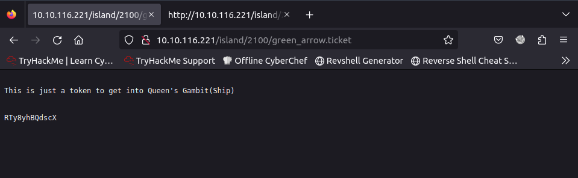

Port 111 Open. Strange.

Some intro. Looks bust needed.

A island.

The word in pure white.

Bust again. Get another hidden directory.

The .ticket? Hmm.

Well.

Looks like we have a user/pass credential. And we have SSH and FTP.

Base58? (Later I find out this was use for bitcoin address.)

Get 3 pic.

Not a pic. Must be somehow steg involved.

The IHDR and IDAT header looks fine. So the problem maybe with the magic number.

Get the password.

Looks like SSH credential.

Oh.

