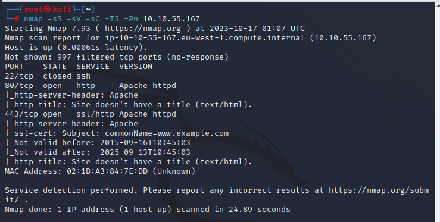

For the first time encounter https. However, they looks identical.

The main page is cool. But did not give any helpful information as I thought.

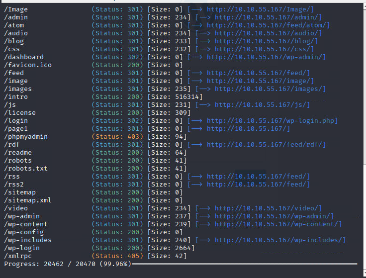

Oh. Famous WordPress.

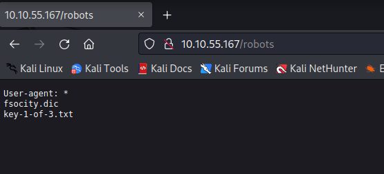

There is 2 links in the robots. One I believe to be one of the flag.

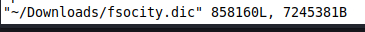

The other file contains one string per line, must be some kind of dictionary. Now we lack the username.

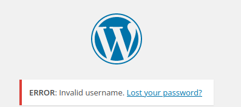

Normally, it would say 'Wrong username or password' etc. But it is clearly to say invalid username now. So we can brute it. 

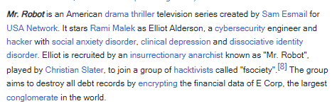

But it is a themed box. Would it be the main character's name? 

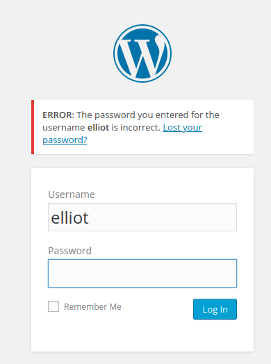

Yes. It is. So just brute for password. 

The process is extremely slow for no reason. So I just search for password in other writeup.

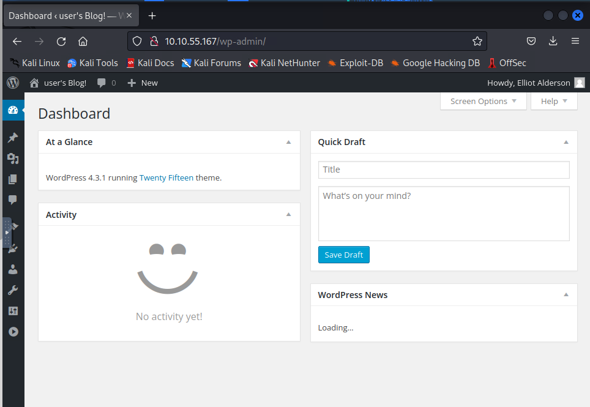

Login now. Seems like we can do anything for the WP.

So let us change the default 404 page to a webshell.

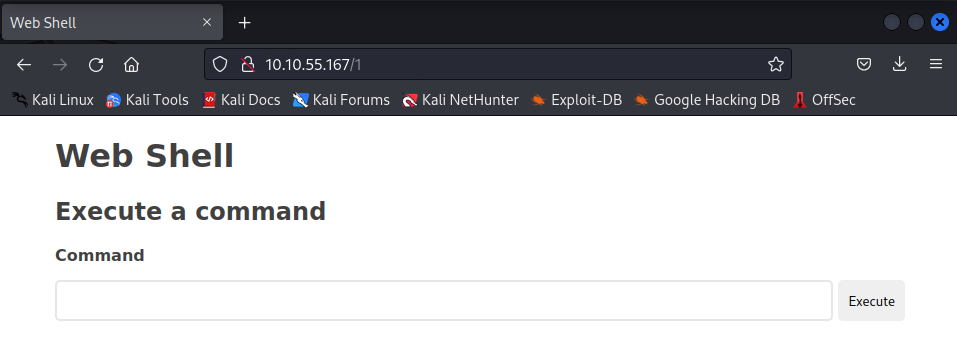

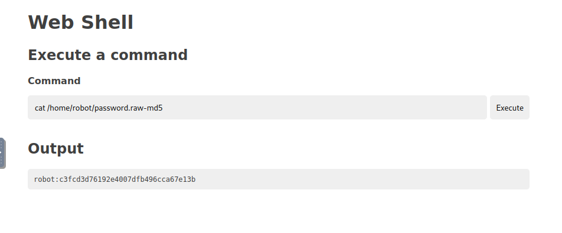

Looks like a SSH credential.

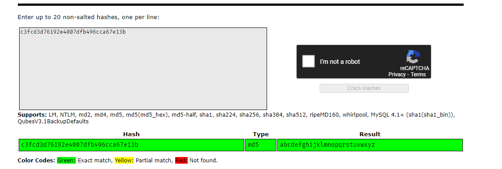

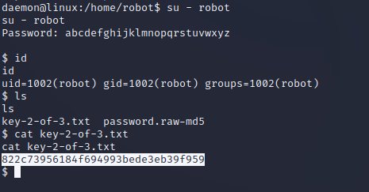

Now time for elevation.

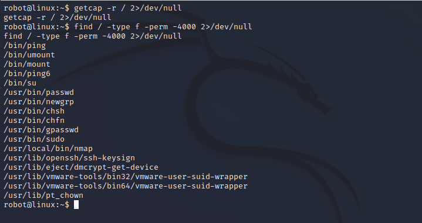

nmap here. Interesting.

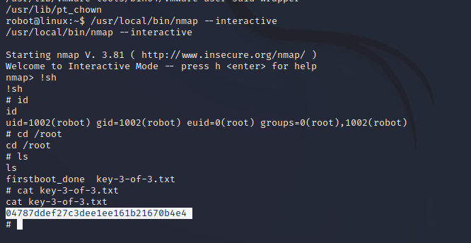

