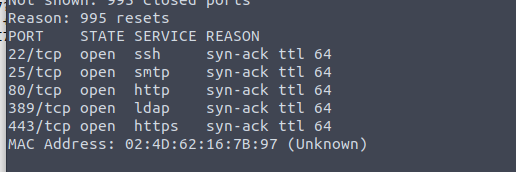
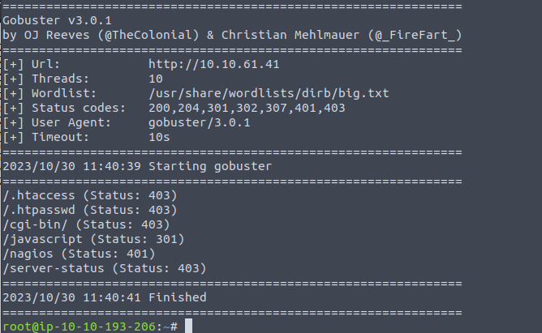
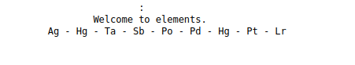
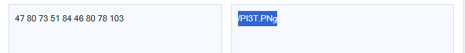
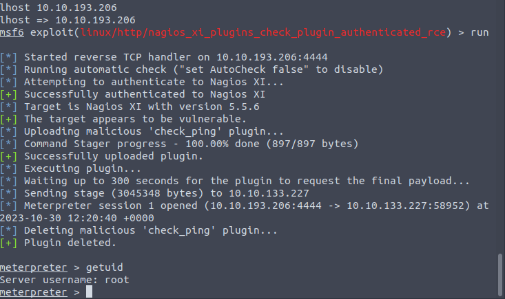

SMTP Hmm.

The nagios require auth. Have to find some credentials.

Some chemical elements. From the Periodic table, we can map each element to its number range 1-100 etc. Looks like ASCII.

We can get the author name simply use exiftool. Then I stuck for a long time.

And, well the pic itself is code. And it is inspired by the author of the pic.

By using the default username and the password extracted from the pic. We can login the dashboard. Now,  time for metasploit.

Root and Done.