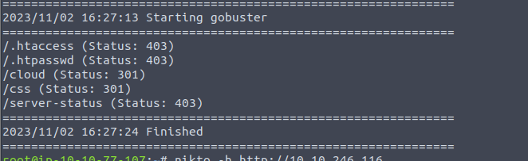

22,80,139,445 Port Open.

SMB looks normal.

Default page is some kind admin panel. Try some default creds but failed.

Bust find a cloud page.

File upload. It have extension filter, but we can easily bypass it by like ".php\x00.jpg".

It kindly provide the file link.

After getting a shell, we can retrieve the website password from the php file. But it points to a static site.

We can find a keepass database in the /opt folder. So download to local machine to crack it.

Now we can get sysadmin creds.

There is a script folder own by root. 

It is kind of tricky actually. The require backup file is owned by root so we cannot modify it. But the folder is own by the user. So we can make our own file.

Done.