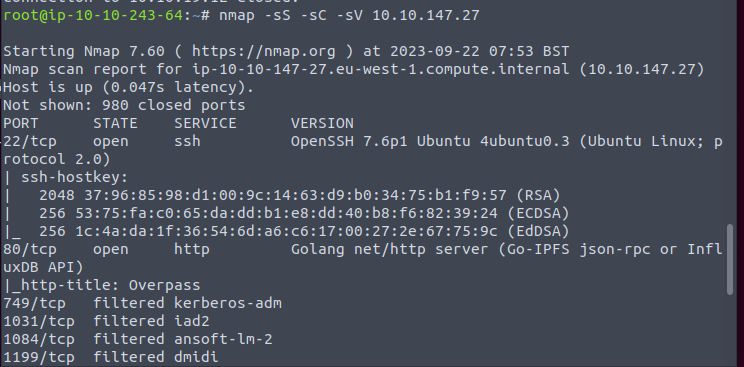
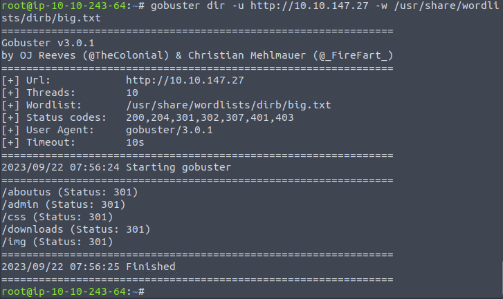
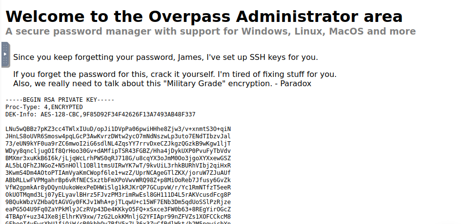
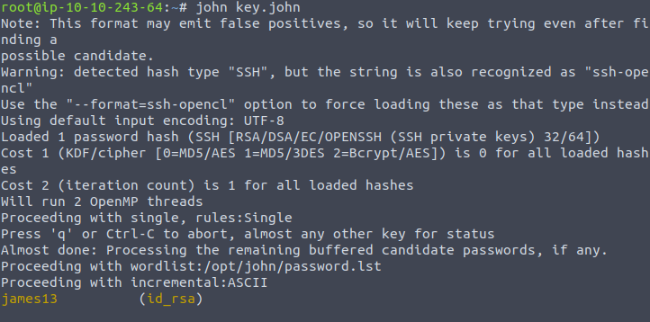
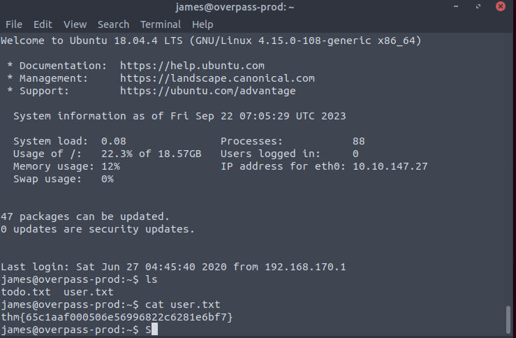
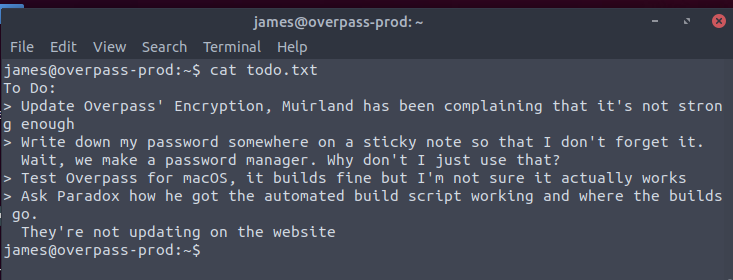
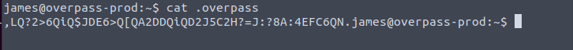
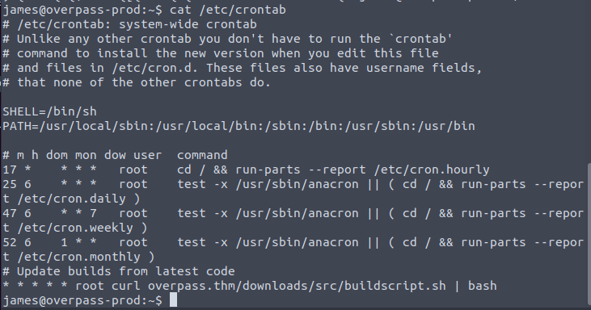
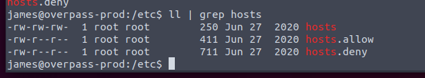

Nmap first

Only 22 and 80 live.

Bust it.

Maybe check admin.

Seems like we can john the ssh key.

Processed with the ssh key.

Get the user.txt

Seems like the password is stored on overpass and not strong encryption.

Hidden files though. Looks like some hash or. Just decrypt it.

(Well. Later I found this is no use for root. But for the bonus subscription. And it requires to read the source of the overpass. I do not know Golang.)

The txt also mentions automated script. So crontab is next to visit.

The root updates source code every minute from online resource. So if we can control the dns, we can make it a reverse shell.

Everyone can rw the hosts file.

Then it is easy. Start a web server to serve a script. Then get the shell.

