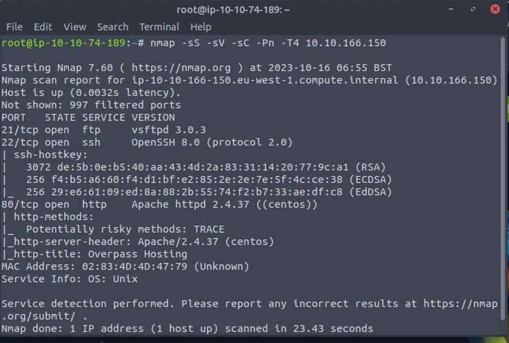

FTP open. But no anonymous login.

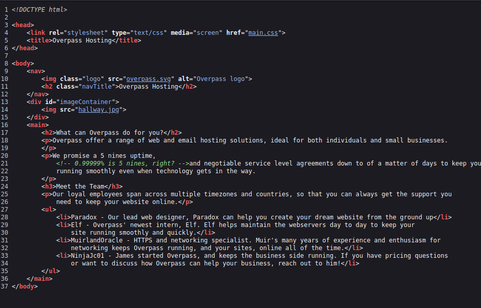

Looks normal.

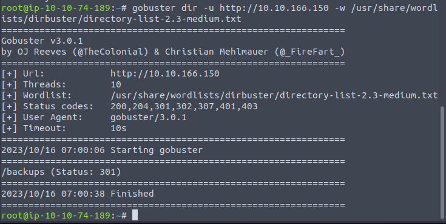

Oh backups.

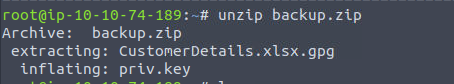

Looks like we need to brute the key.

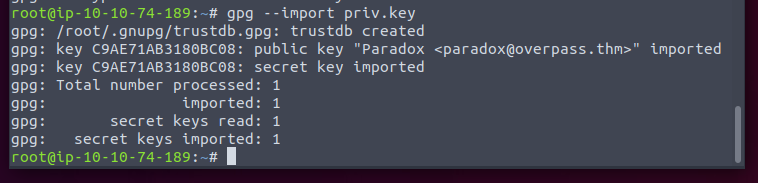

No password protected. Great!

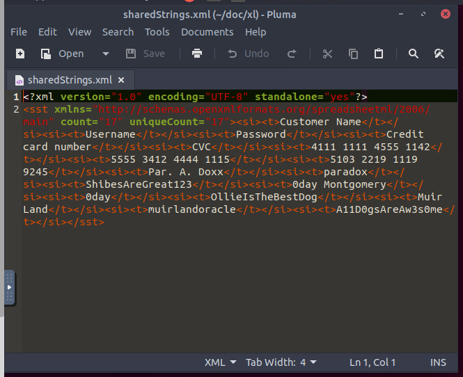

So we can extract some credentials.

Although I hope it would be for SSH, but it is for FTP. Since the SSH do not allow password auth.

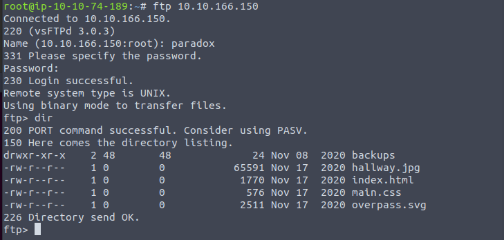

Noticed that we have write permission. So time for webshell.

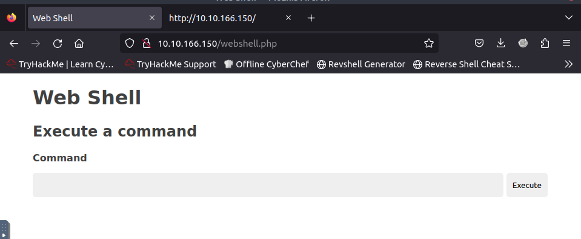

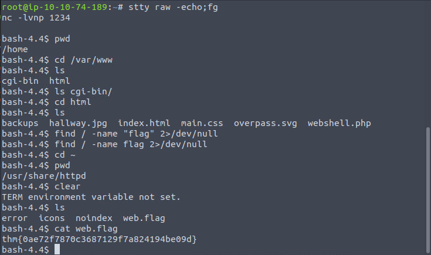

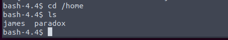

We can try to switch to parabox using the same password.

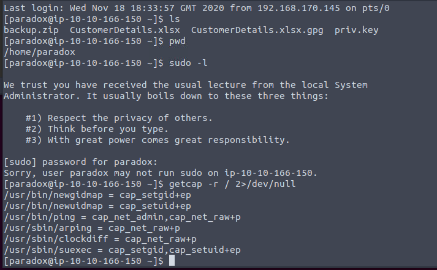

We can. And we find some binarys with cap. Sadly none of them works.

By searching the web, I get to know that the machine's NFS configure is bad.

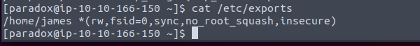

The no_root_squash allows any other machine's root user acts like root.

But we do know from the previous nmap scan that few ports were opened. So we have to tunnel the NFS traffic using SSH etc.

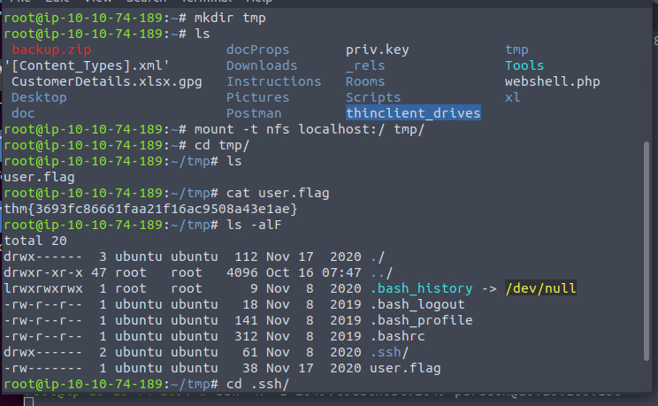

And get jame's SSH key.

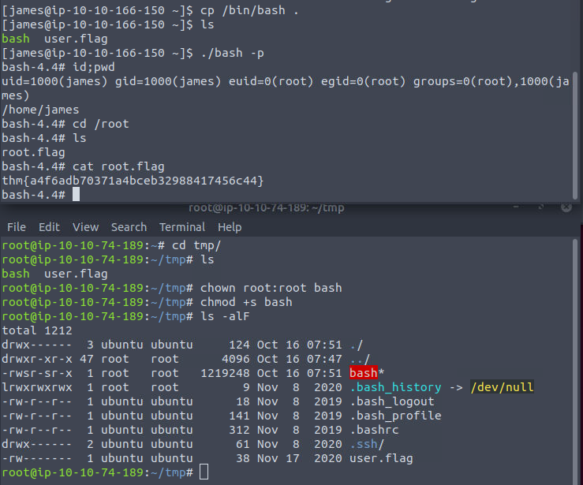

Using our attacking machine to add setuid to the bash binary.

