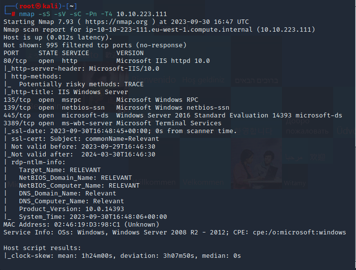
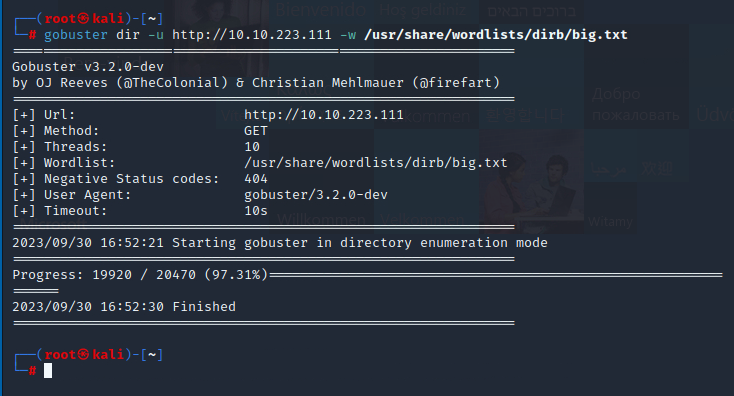
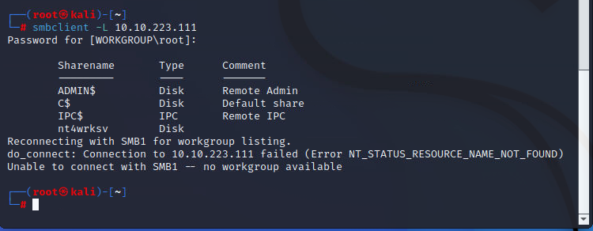
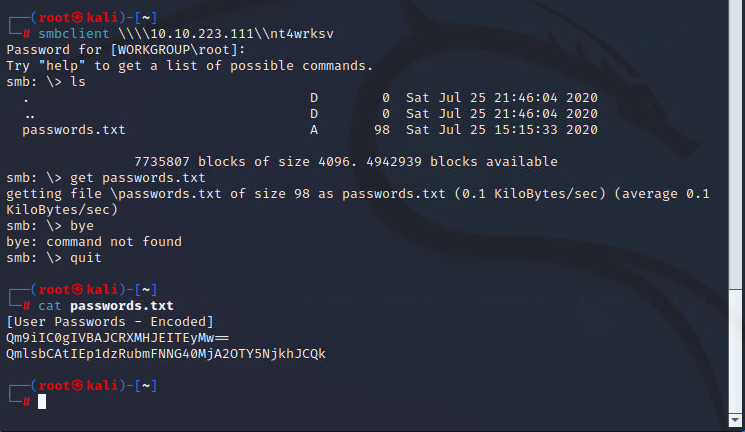
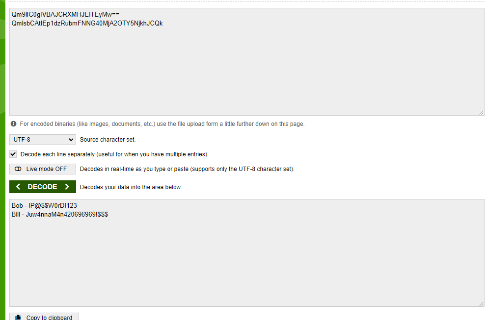
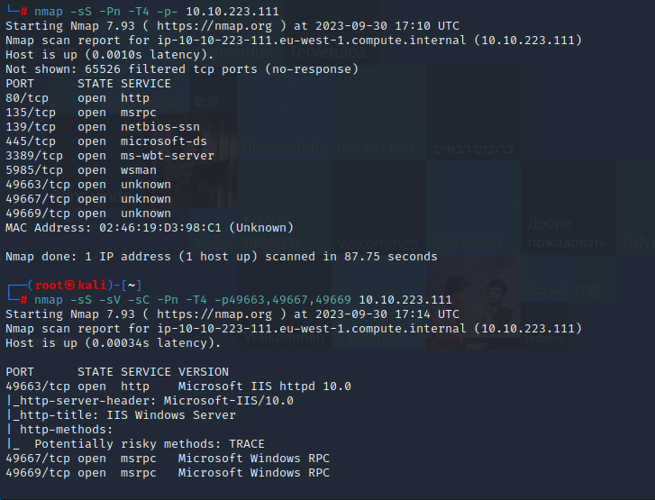
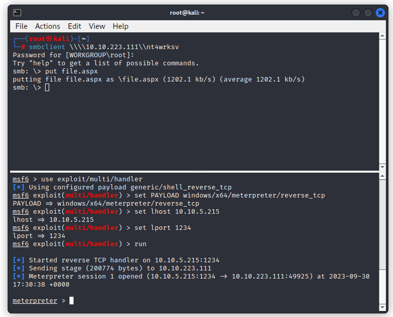
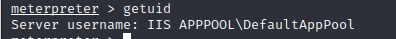

Got several ports opened. Bust first.

Empty.

It is running SMB. Check whether some files on the share.

A strange share name revealed. Hope it require no password.

We got two user-password pair. Try RDP then.

Alright. I look the official writeup. The creator placed these two credentials intentional.

We **should** do a full port scan first.

There is another IIS in high port. Bust it.

And actually we can find we could visit the smb from website. So it is nice if we can upload to the smb.

We can. So get the shell.

Although just a low privilege account.

After searching the Internet, we can use PrinterSpoof to get the SYSTEM since we have impersonate priv.

Actually the target is also eternal-blue able. Then it is much easier.

 