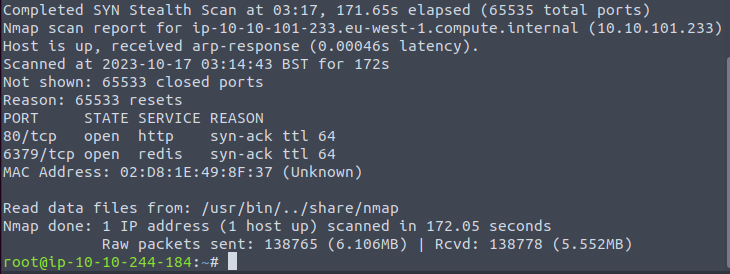
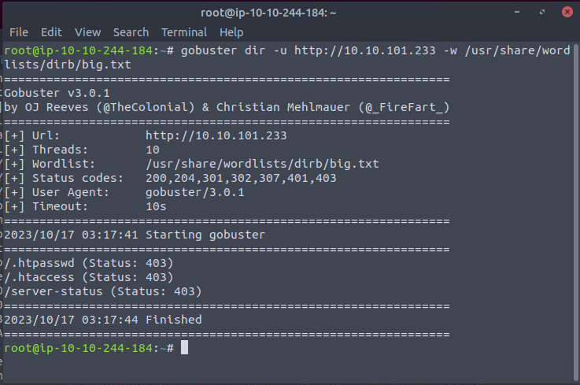
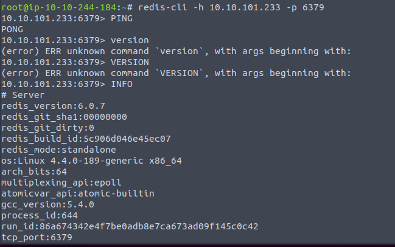
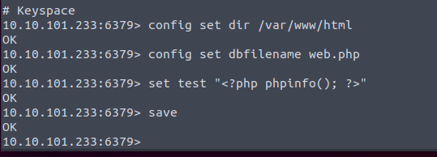
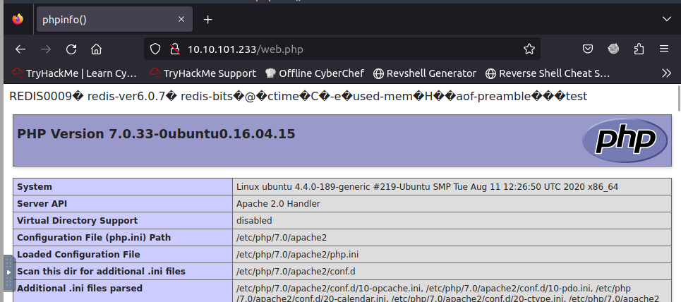
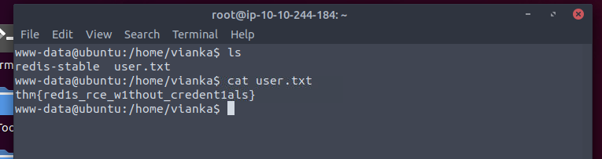
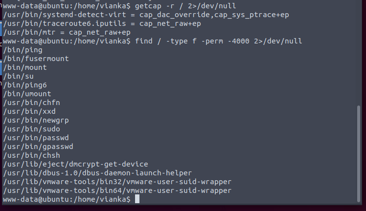
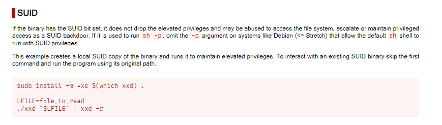
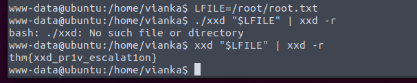
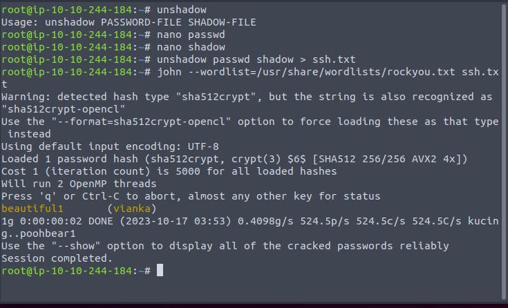

Only HTTP and Redis.

Default web page.

Looks like nothing valuable in the web.

No auth required.

Test whether we can upload something to the web folder.

It works. So time for webshell.

We can read the user flag. Now try to switch user.

Oh.

