Nmap first

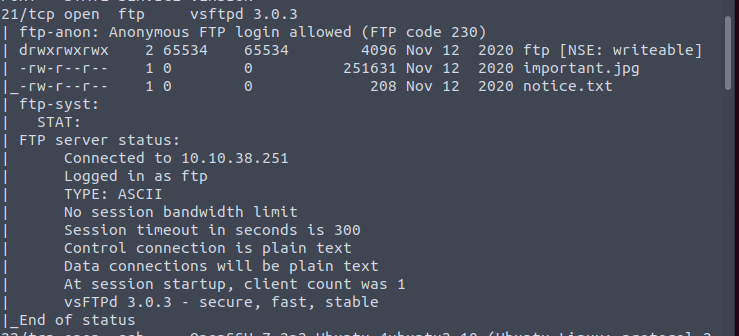

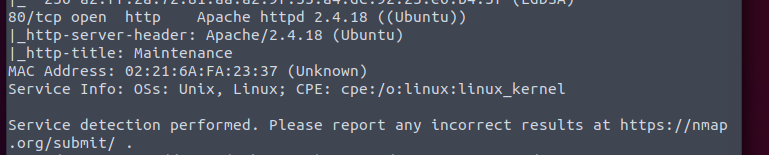

Anonymous FTP allowed. So we download files first.

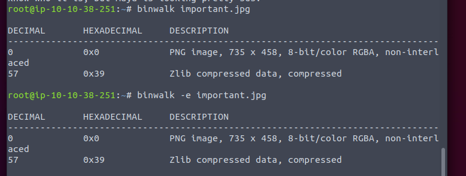

The pic is not a real pic. Extract the zlib will get some mysql thing. Ignore it first.

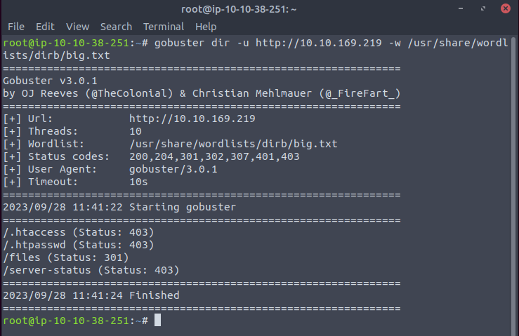

Seems like we can download some files.

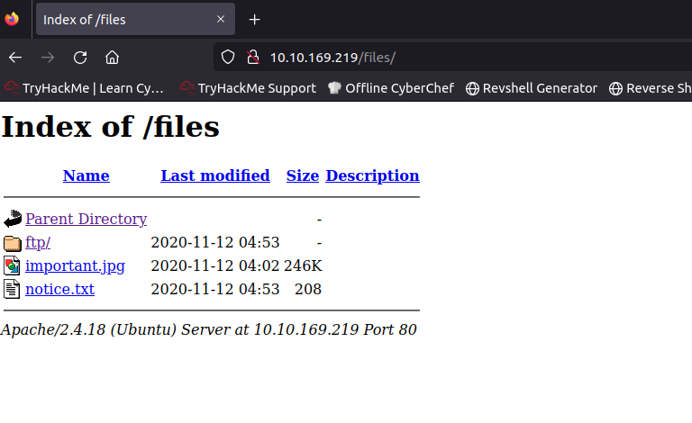

Well. It is the ftp folder.

According to nmap, we can write to the ftp. So we should try it.

Using [this](https://github.com/artyuum/simple-php-web-shell/blob/master/index.php), we get a web shell.

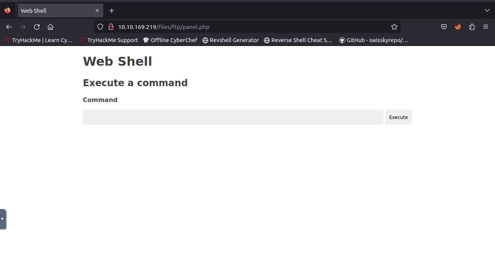

It is time for reverse shell.

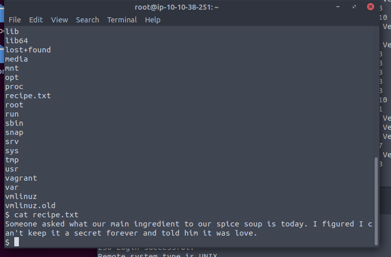

We can answer the first question. But we do not have permission to the home folder.

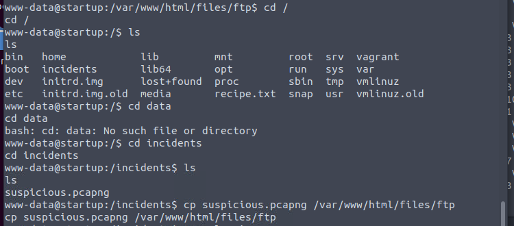

We can find a package so we just copy it to ftp that we can download on website.

By analyzing the packet, we can get the password for lennie.

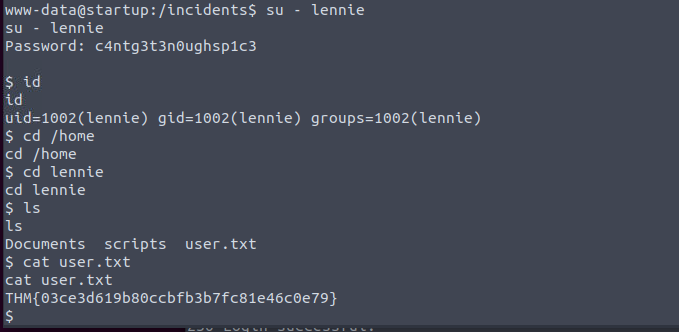

Get the user flag. There is a folder called scripts.

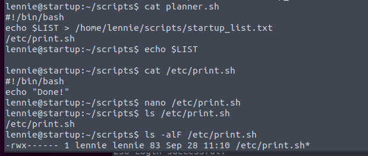

We can edit the print.sh. So it is done.

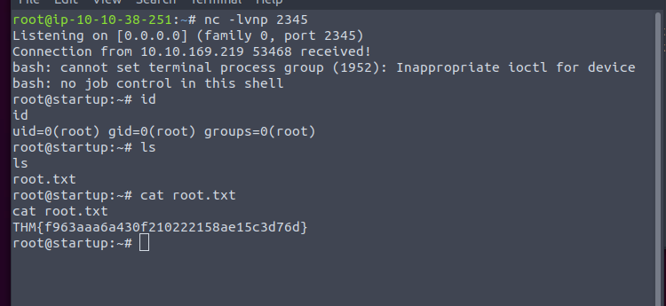

