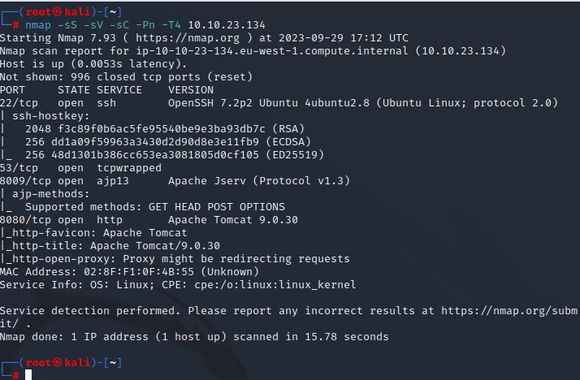
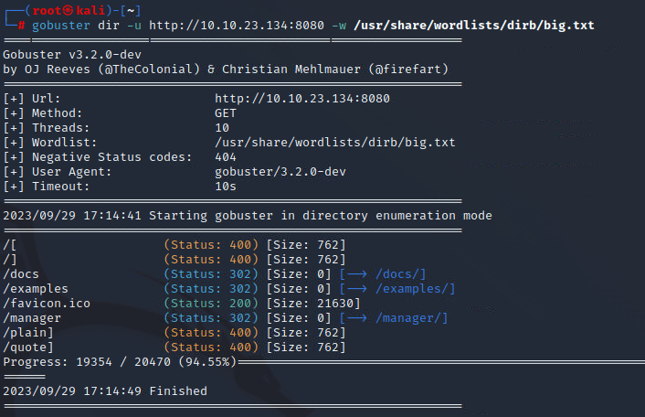
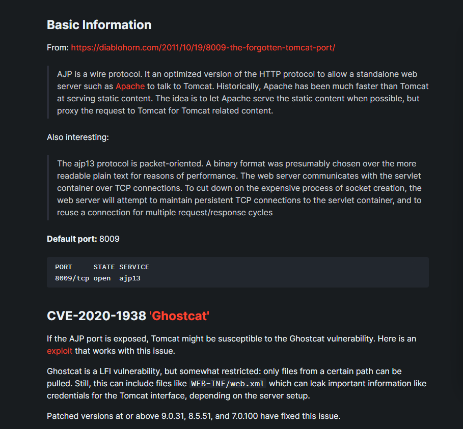
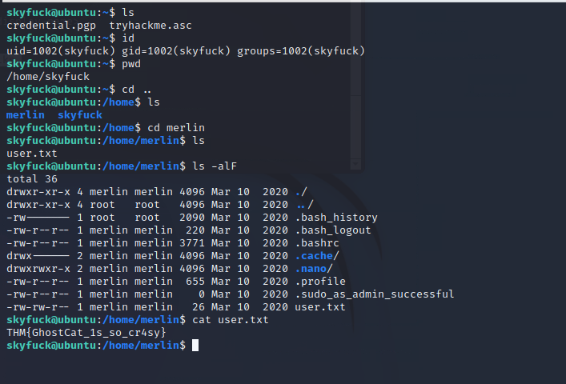
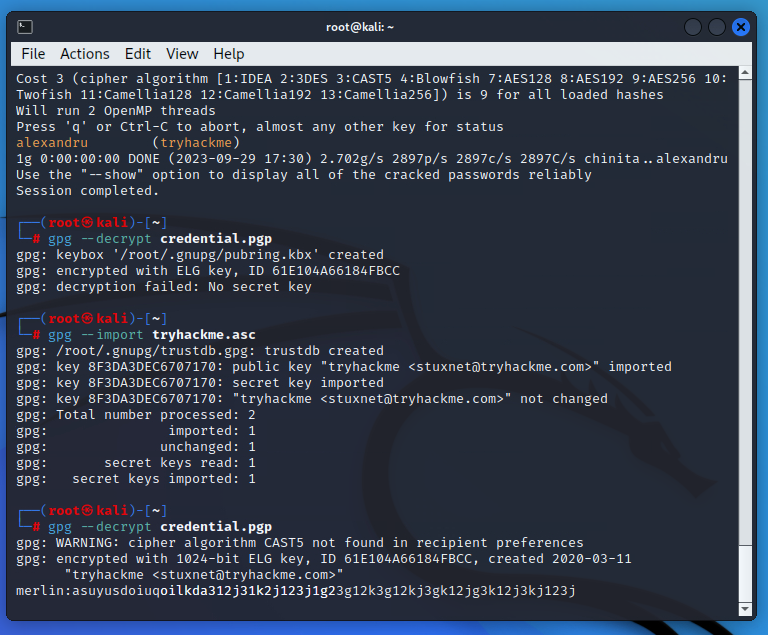
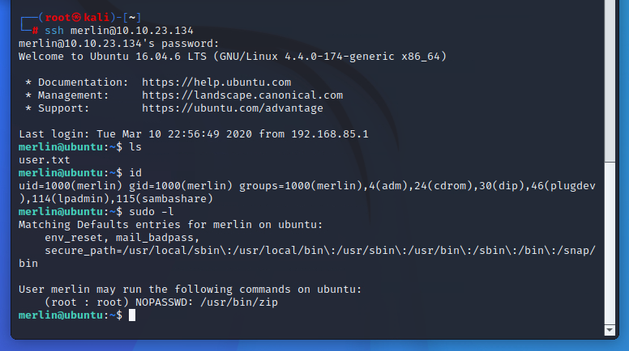
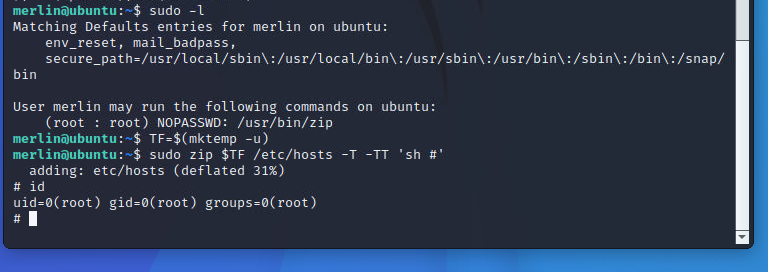

The label says tom. Seems like relate to Tomcat.

Well. We get Tomcat. And a interesting one called Jserv.

Bust it first to look for some hidden folder.

Very normal. So we should hope whether some exploit of tomcat or Jserv exist.

Seems like we get it.

Just using the exploit we can see the inf file.

Looks like password. And we know the ssh open.

So we get the user flag.

And we have a GPG encrypt file and its corresponding key. We need to john it.

Get the password for merlin.

We can sudo the zip. According to gtfo,

Get the root.