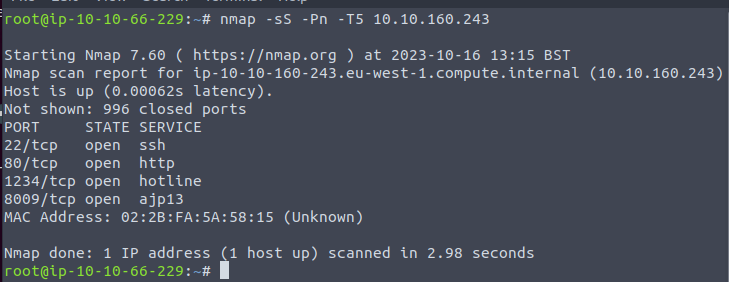
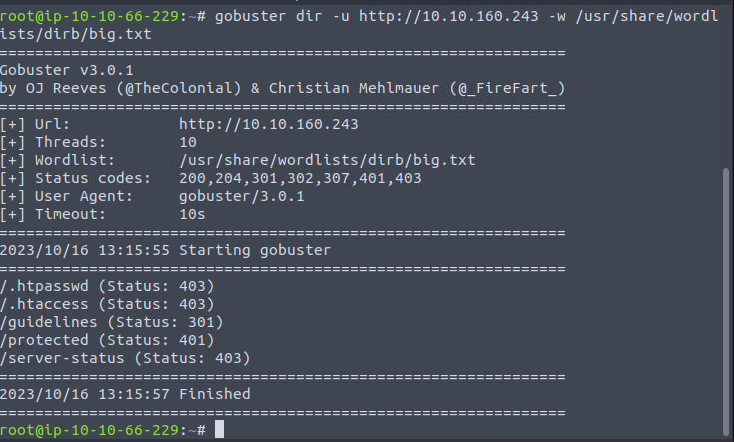
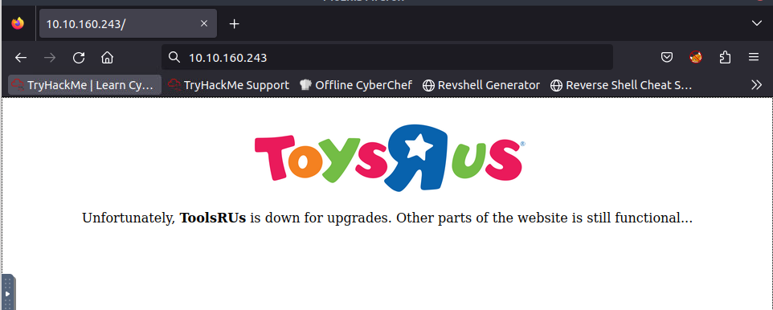
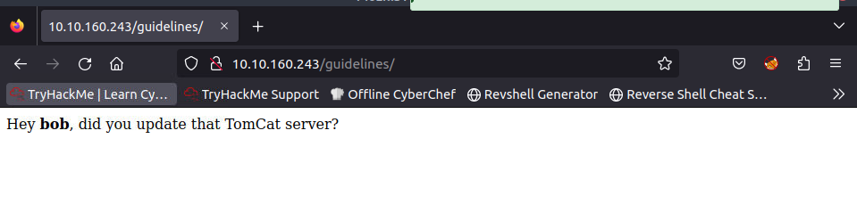
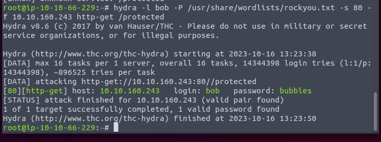
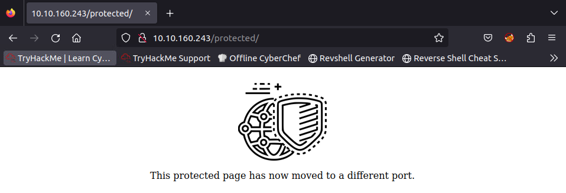

2 Not frequently seen ports.

Seems like a vulnerable.

Maybe the 1234 port we find earlier.

The 1234 port is a Tomcat page. And we use the same http credential for the manager panel.

By using the metasploit, CVE-2009-3458 (Very old exploit). Everything is done. We get the root shell.