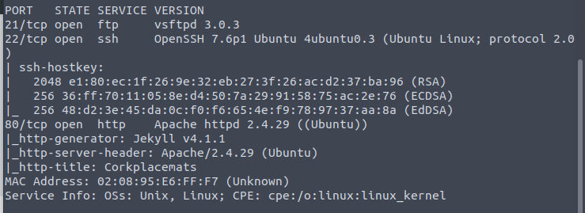

No anonymous login this time.

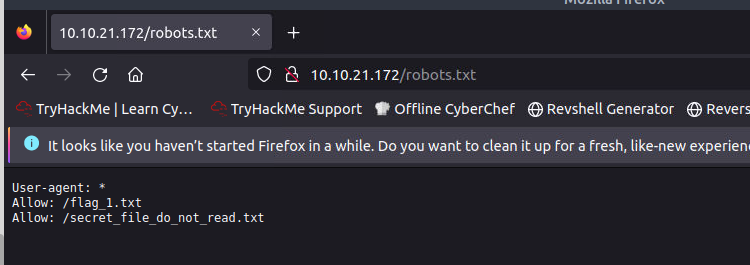

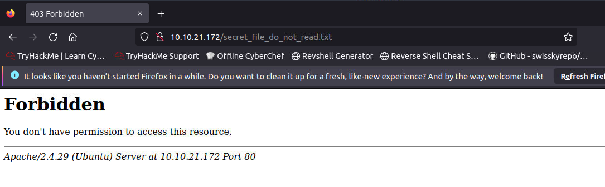

Real secret.

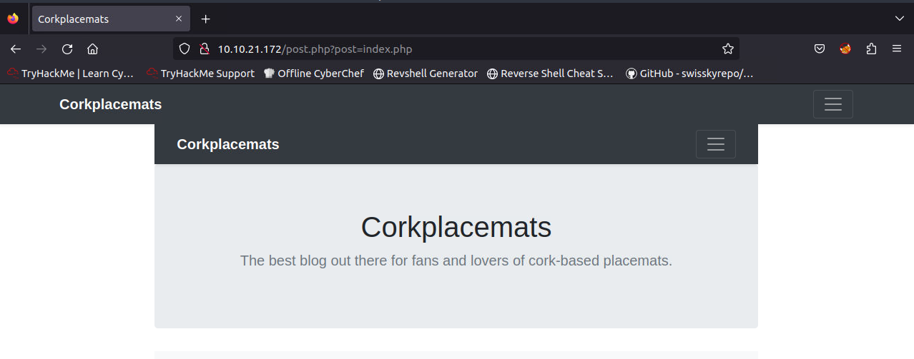

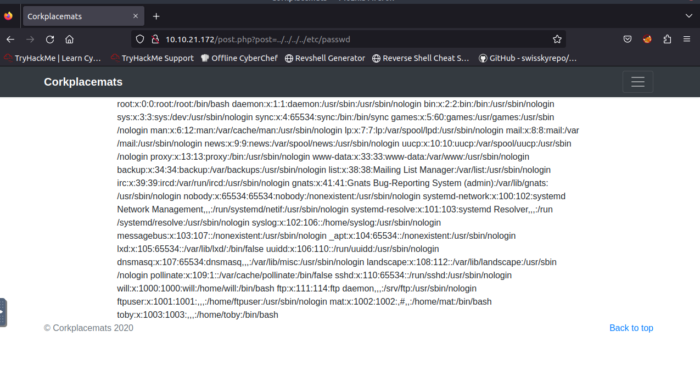

Ohh LFI.

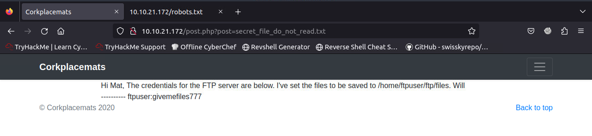

No more secret now.

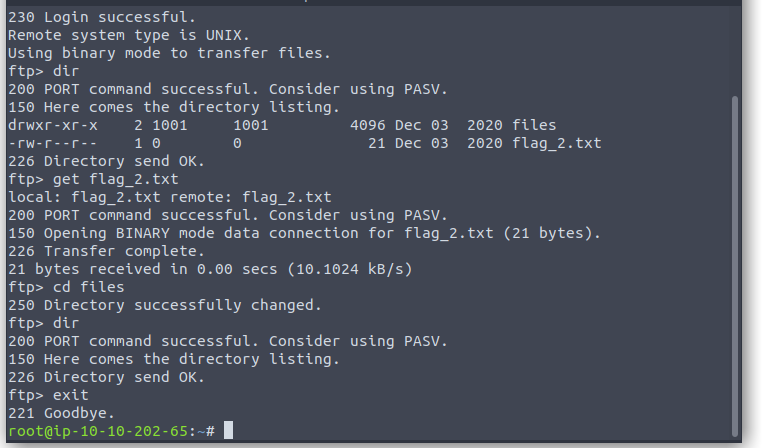

Seems like we can upload to the folder. Then get the webshell run by LFI.

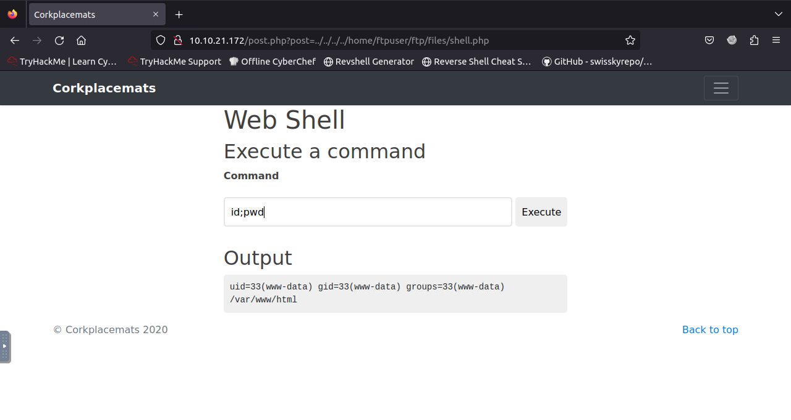

Great.

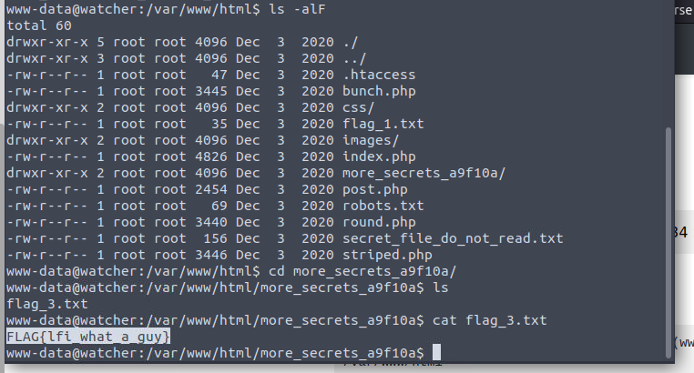

More secret.

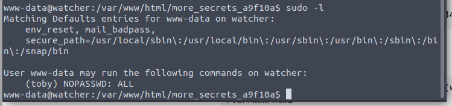

At least we can switch to toby.

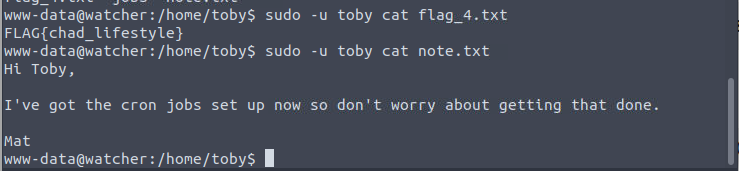

Crons.

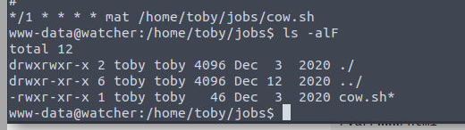

Run as mat. And toby have edit permission.

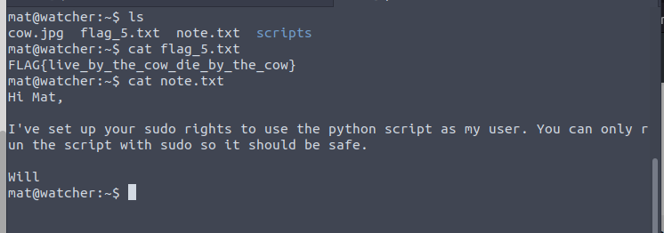

Now for python script.

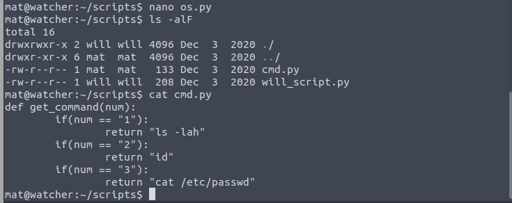

We can edit the cmd script to a shell.

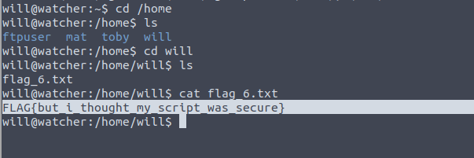

Yeah. Quite secure.

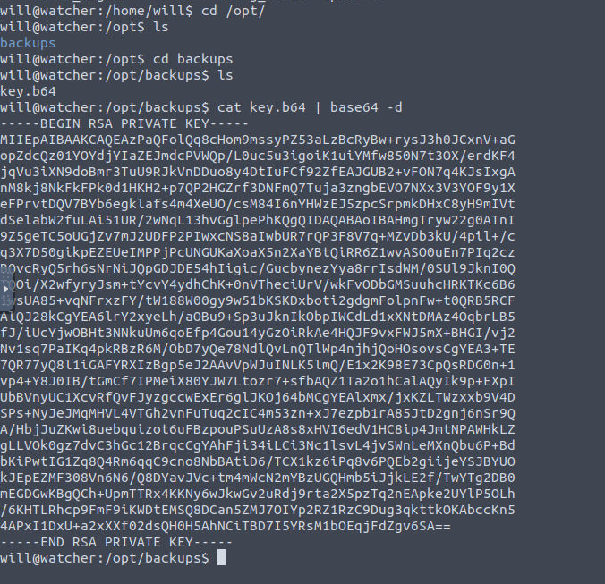

Oh. A key. At this time I believe it must be the root user.

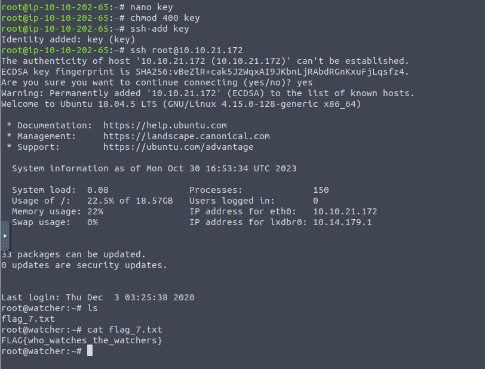

Done.

