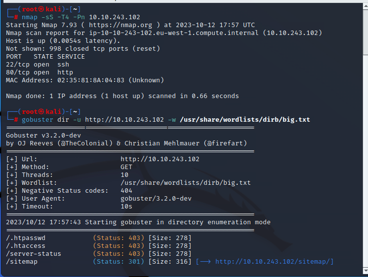
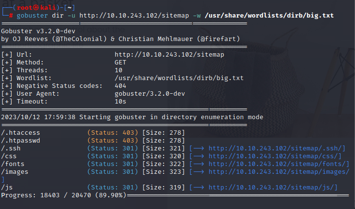
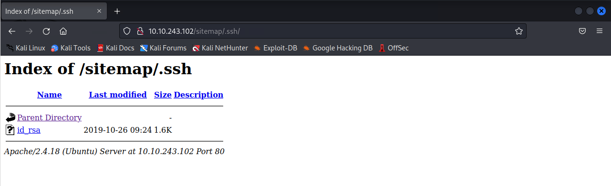
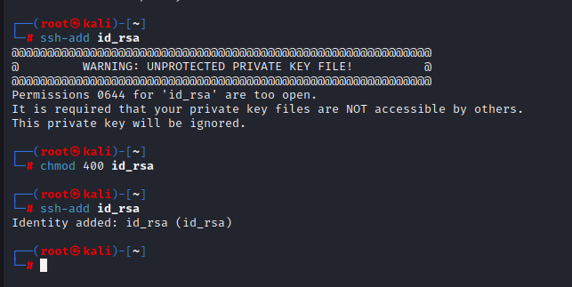
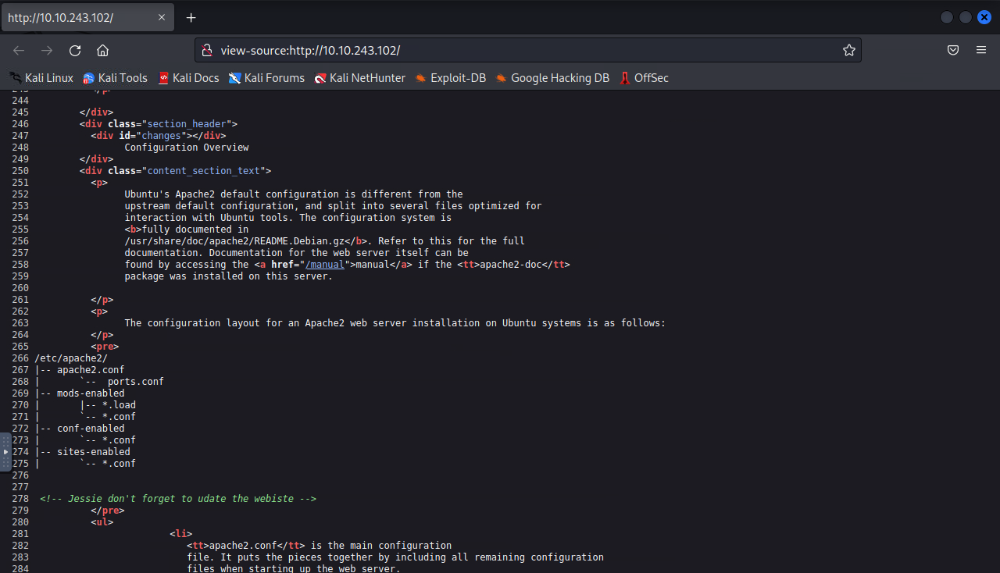
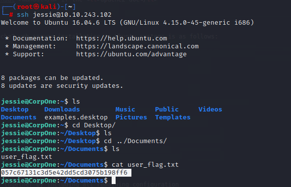
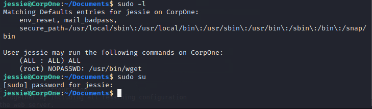
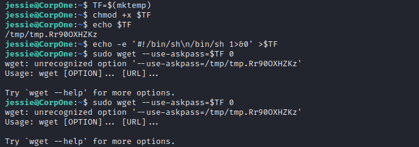
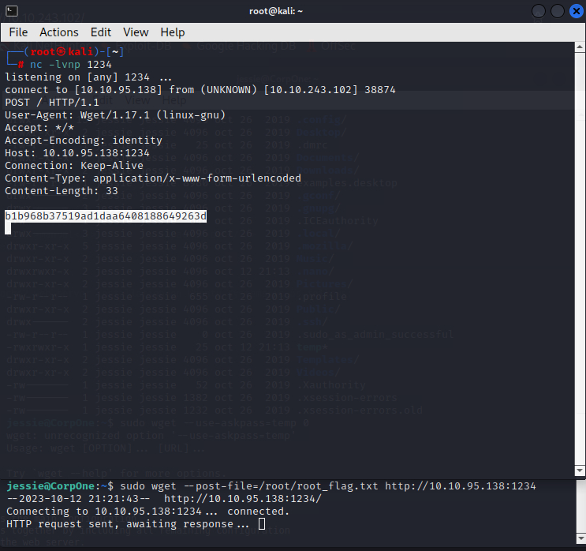

Looks like the web is the way.

The .ssh is quite worth to visit.

Looks like the ssh key.

And no password protected. Now we need the username.

At this page, it mentions someone called jessie. Looks like a developer.

Time for root.

We can directly sudo to root but we need password for current user. But the second one looks good.

The sudo way to root cannot run successfully in the machine. So we have to find another way.

Get.