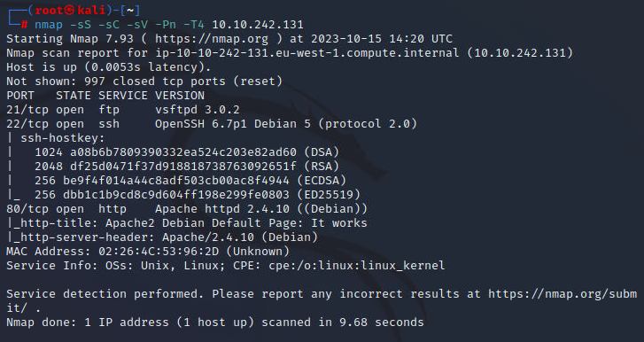

Have a FTP, but looks like no anonymous login.

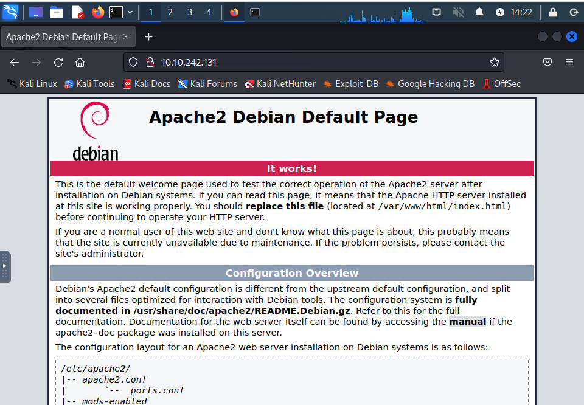

Default page. Bust needed.

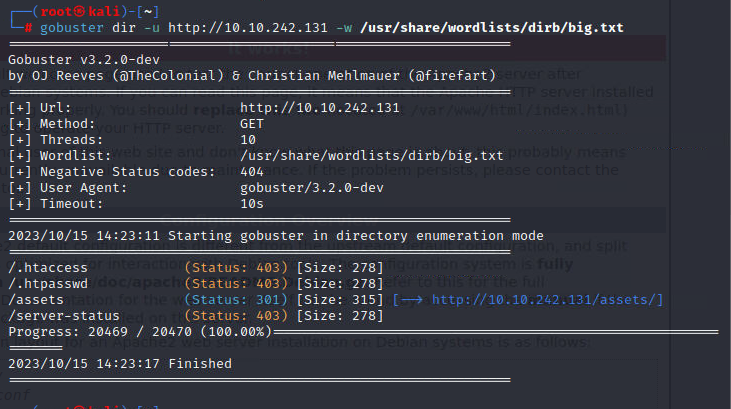

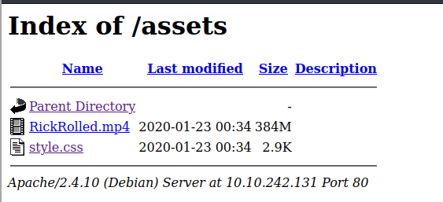

Rickrolled... And a strange css file.

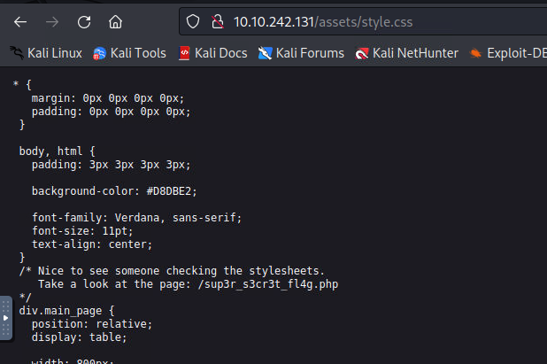

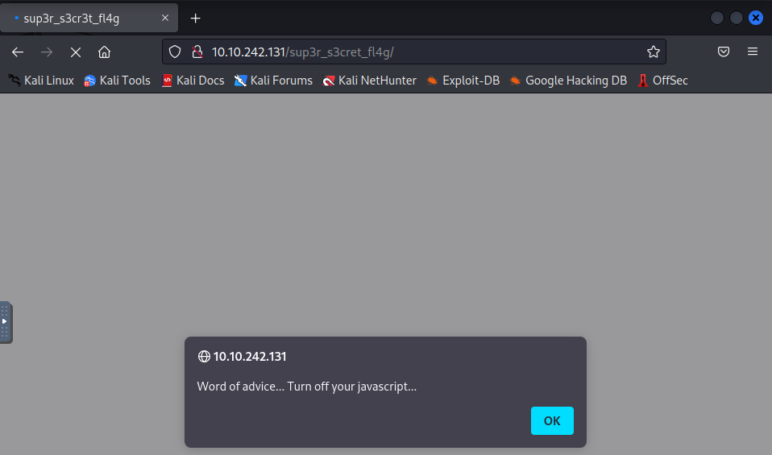

Thanks for the ad.

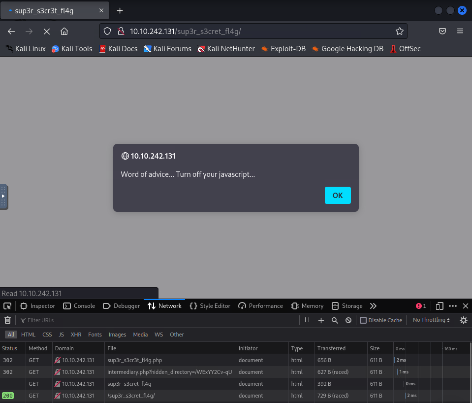

By capturing the traffic, seems like there is another hidden folder.

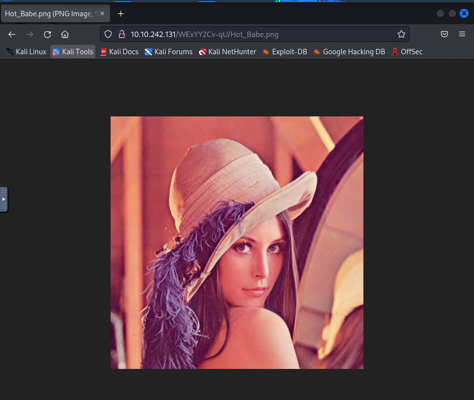

A very famous pic in CV field. But here, maybe some steg.

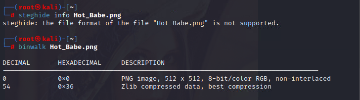

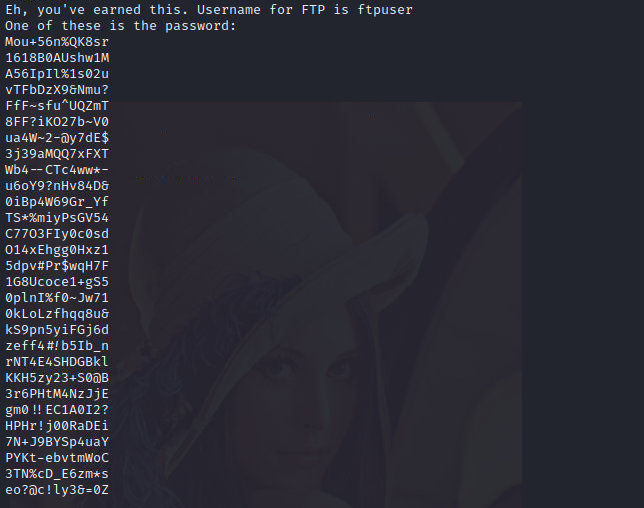

It is time for hydra.

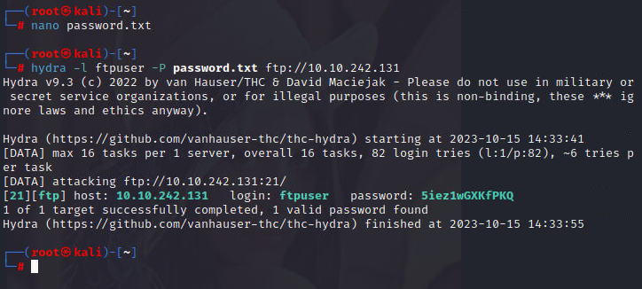

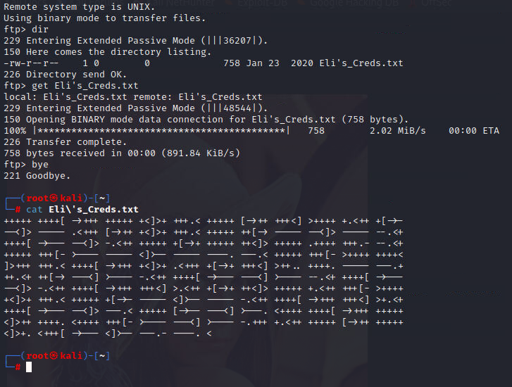

Some very strange combination. 

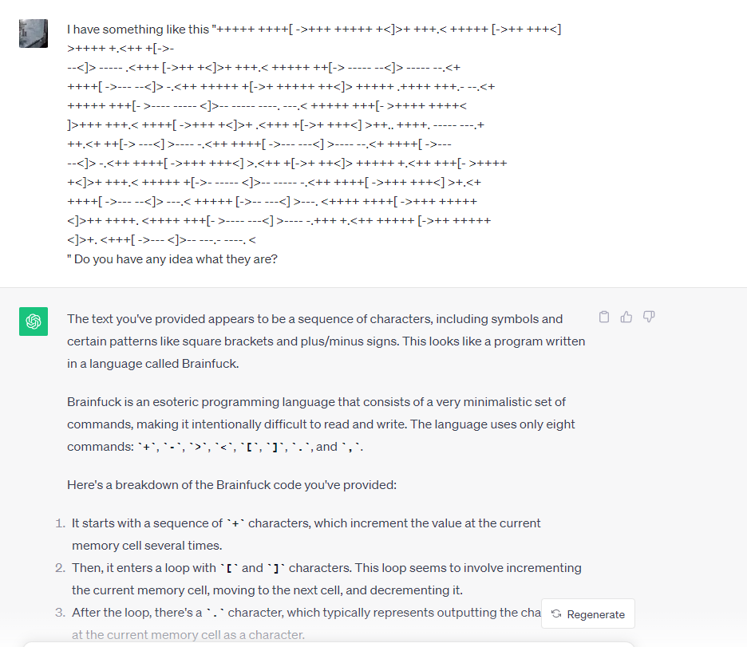

It is a programming language.

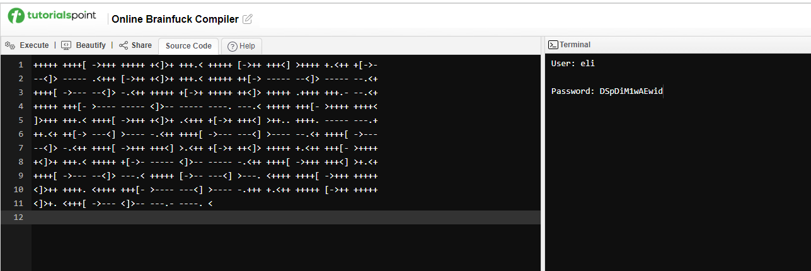

Alright. Looks like we get the ssh credentials.

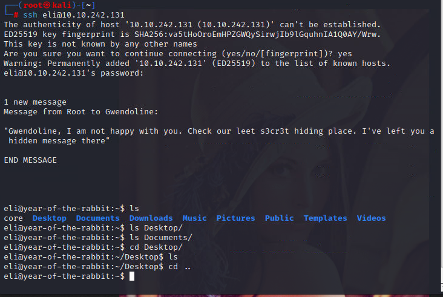

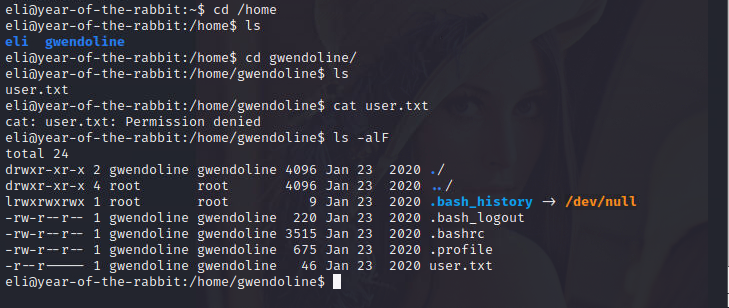

Lack the permission to read the user flag. Maybe the info given when connected to ssh are somekind useful.

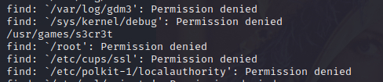

Oh. Get the secret folder.

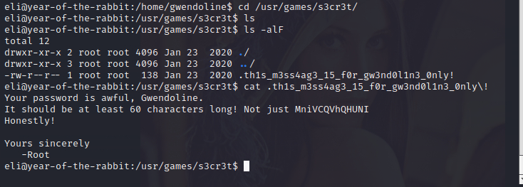

Looks like the current password is given.

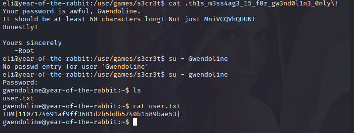

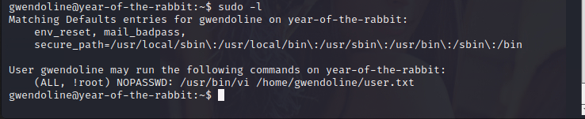

Somehow interesting. The user is the owner for user flag, so we can edit it. But cannot sudo as root.

By referencing other writeup, there is a vulnerability CVE-2019-14287.

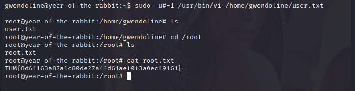
